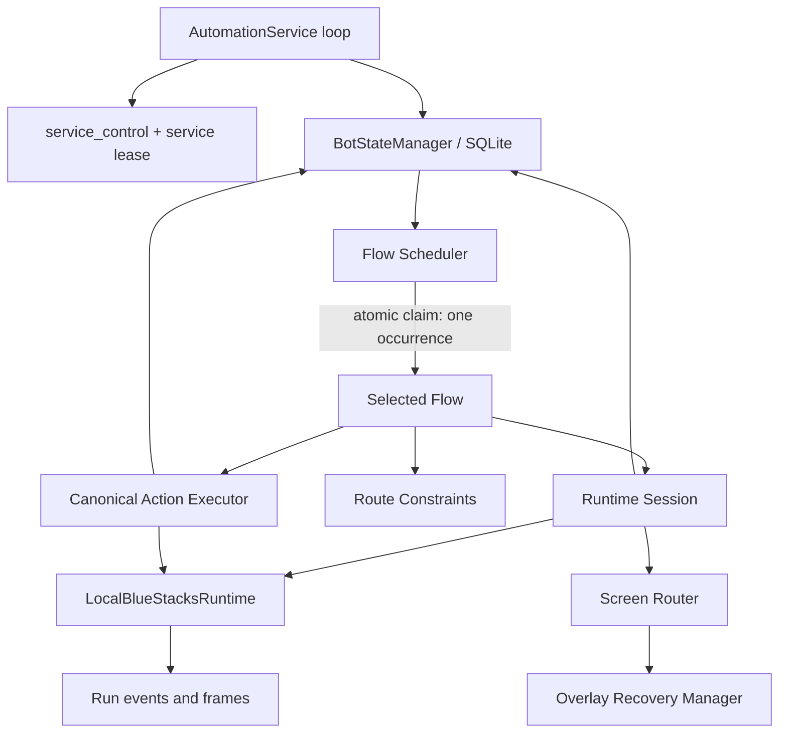

# Puzzle & Survival Bot Governance Simplification Plan

## Purpose

Pause gameplay-flow delivery and simplify the repository before continuing toward unattended 24/7 operation.

The desired bot is deliberately small:

- One persistent state manager.
- One timer/daily scheduler.
- Exactly one active flow at a time.
- One runtime input owner.
- Route-specific safety and gameplay constraints.
- Reliable OCR, screen classification, popup recovery, and navigation.
- No Git, PR, backlog, agent, or evidence ceremony in the runtime authorization path.

This is a reduction, not a rewrite of gameplay intelligence. Preserve the existing recognizers, route semantics, input safety, and reset/timer logic. Remove or consolidate the development-delivery machinery surrounding them.

## Decision

Simplify in place around `automation_service`. Do not add another orchestration package.

The repository contains a useful runtime and scheduler kernel, but it is buried under a development-delivery control plane that has become a second application. Queue status, product policy, execution matrices, registries, delegated receipts, Git fingerprints, leases, handoff files, evidence manifests, and route-local ledgers all influence runtime decisions. These sources already disagree.

The target authority model is:

1. SQLite `service_control.enabled` is the sole global runtime transport gate, and SQLite `flow_state.enabled` is the sole per-flow runtime enable authority.
2. A static `FlowSpec.default_enabled=False` can initialize a missing row only; no static or external source can enable a persisted flow.
3. A transaction atomically selects and claims one eligible occurrence.
4. The claimed occurrence receives one fenced runtime session.
5. Every input passes through one action executor, which revalidates all generations and stable semantic ROIs immediately before dispatch.
6. Static route code supplies route-specific constraints.
7. Runtime outcomes return to SQLite.
8. Evidence records what happened but never authorizes execution or retry.

The global switch is a gate, not a second per-flow enable authority: it can stop all new claims and fence subsequent actions, but it cannot make a disabled flow eligible. A live manual run is subject to exactly the same two SQLite gates as a scheduled run. `bot observe` is permitted while disabled only because it is structurally zero-input.

## Current architecture problems

### Governance outweighs the runtime

The selected core/governance surface is approximately 24,860 lines:

- `scripts/pnsctl.py`: 8,354 lines.
- `scripts/flow_delivery_control.py`: 3,877 lines.
- `scripts/navigation_development_boundary.py`: 1,339 lines.
- `scripts/bluestacks_native_runtime.py`: 783 lines.
- `automation_service/*`: approximately 1,225 lines.
- Queue, policy, and matrix JSON: approximately 8,500 lines.

`scripts/pnsctl.py` simultaneously owns CLI parsing, registration consumption, delegated-receipt validation, reset identity, startup recovery, route dispatch, evidence generation, scheduler adapters, and flow-specific exceptions. Its `development_session_run_flow()` claims to operate without queue or lease ceremony, but later consumes registration and enters delegated runtime context.

### The same facts have several authorities

Current governance includes:

- 34 delivery-queue flow records.
- 31 execution-matrix objectives plus 8 support flows.
- 24 disabled-production registry entries.
- 15 BlueStacks registry entries.
- 35 gameplay contract files.

Status, dependencies, attempt budgets, registration state, evidence requirements, and production eligibility are repeated across these files.

Observed contradictions include:

- Campaign AP is represented as both `completed` and `blocked_evidence_required`.
- Its live-attempt budget appears as 6, 10, 15, and 25.
- Hero identity appears as `Wali` in product policy and `Wally` in the matrix/backlog.
- Daily-row dependencies differ between the queue and execution matrix.
- Gathering is direct Home to World in product policy but selected-Daily work in the matrix.
- Supply Depot permits and forbids semantically the same Claim action because one version is embedded in a composite string.

These are operational risks because different execution paths consult different sources.

### Runtime authority is stacked

A live action can currently depend on:

1. Flow-delivery queue state.
2. A flow-delivery lease.
3. A delegated runtime receipt.
4. Exact command arguments and a Git/content fingerprint.
5. Production registration or disabled-registry state.
6. A scheduler occurrence claim.
7. A runtime input lock.
8. A canonical action-store reservation.
9. Native runtime duplicate-action tracking.
10. Route-local ledgers or continuation files.

The runtime lock, action reservation, native target binding, and durable scheduler state contain real safety value. Queue activation, Git fingerprints, agent identity, PR state, and evidence receipts govern development workflow rather than gameplay safety. During migration, those safeguards may not be removed until their equivalent durable semantics are proven. In particular, `ResourceEffectAuthority` remains authoritative for resource-effect routes until the canonical action model demonstrates equivalent occurrence, quantity, reservation, unknown-effect, and changed-hypothesis protection.

### The VIP failure demonstrates duplicated ownership

The repository already has a canonical exact VIP/Get Pts popup recognizer in:

- `scripts/bluestacks_popup_recognition.py`

Daily instead imports World’s private generic popup detector:

- `scripts/daily_row_claim_bluestacks.py`
- `scripts/world_map_navigation_bluestacks.py`

Startup recovery does not assign Daily a shared recovery owner:

- `scripts/startup_recovery.py`
- `tests/test_startup_recovery.py`

`pnsctl` can therefore classify and block the frame before Daily reaches its optional route-local popup handler.

World, Ultimate Challenge, and Campaign also implement independent VIP transport and successor loops. The same popup has several recognizers, owners, action paths, and successor assumptions. Daily additionally assumed that closing the popup must lead to selected Daily even when the popup appeared over Home.

This was an authority-wiring failure, not a missing OCR detector.

## Target architecture



### One SQLite state manager

Use one database, for example:

`.local-orchestrator/bot-state.sqlite3`

Suggested tables follow. The names and transitions below are the canonical runtime contract; no queue, registry, evidence file, environment variable, or CLI flag may substitute for them.

#### `service_control`

- Singleton primary key.
- `enabled`: the sole global switch permitting new claims and subsequent input validation.
- `generation`: monotonically increasing fence, incremented whenever the global gate is disabled, re-enabled, or emergency-stopped.
- `emergency_reason` and `emergency_at_utc`.
- `updated_at_utc` and `row_version`.

`enabled=false` is the emergency-stop state for transport. An emergency stop also increments `generation`, marks active runs as stop-requested or causes their next revalidation to do so, and prevents new claims. It cannot withdraw an ADB input already issued. An in-flight transport is reconciled when it returns; if the process dies before reconciliation, its `DISPATCHING` action becomes `UNKNOWN` and is never automatically repeated. Once emergency stop is cleared, the old run generation remains fenced and must not resume dispatching; a new claim is required after explicit recovery.

#### `service_lease`

- Singleton primary key.
- `owner_instance_id` and process identity (`pid`, `process_start_token`).
- `lease_generation` and expiry/heartbeat timestamps.
- Ownership is valid only for the current owner, token, and generation.

The service lease prevents competing service loops, but it is not a second flow-enable authority. Stale owners cannot act after lease takeover because the action executor checks the lease generation before every dispatch.

#### `flow_state`

- `flow_id` primary key.
- `enabled`.
- `generation`, incremented atomically on every enable or disable.
- `next_occurrence_key` and `next_due_at_utc`.
- `schedule_anchor_utc` and reset identity.
- `retry_not_before_utc`.
- `eligible_since_utc` or equivalent oldest-due timestamp for bounded starvation.
- `last_started_at`, `last_completed_at`, `last_outcome`.
- `consecutive_failures` and `blocked_reason`.
- `row_version`.

`enabled` and operational blocking are orthogonal. Disabling a flow makes it ineligible and fences any claimed run; re-enabling it does not silently clear `blocked_reason`. An explicit unblock operation is required for a safety block. `next_due_at_utc` describes schedule cadence, while `retry_not_before_utc` describes failure backoff; neither is allowed to overwrite the other.

#### `runs`

- `run_id` primary key.
- Foreign key to `flow_state`.
- Deterministic `occurrence_key` and immutable claimed reset identity.
- `claimed_flow_generation`, `service_generation`, `owner_instance_id`, and `lease_generation`.
- `mode` (`scheduled` or `manual`).
- State: `CLAIMED`, `RUNNING`, `STOP_REQUESTED`, `RECOVERING`, `SUCCEEDED`, `DEFERRED`, `BLOCKED`, `FAILED`, or `ABANDONED`.
- Claim, start, heartbeat, stop-request, and terminal timestamps.
- Input/resource budgets and consumed counts.
- Terminal outcome and reason.

A partial unique index permits at most one active run in `CLAIMED`, `RUNNING`, `STOP_REQUESTED`, or `RECOVERING`. A unique `(flow_id, occurrence_key)` constraint prevents a second successful execution of an occurrence. Retries reuse the same occurrence key but have their own action identity and, only where explicitly permitted, a changed hypothesis.

#### `actions`

- `action_id` primary key.
- `run_id` foreign key and `sequence_no`.
- Globally unique `idempotency_key`.
- Semantic action key.
- Source capture ID and full-frame hash for provenance/cache lookup only.
- Stable source-binding digest.
- Target identity, stable ROI, and target-binding digest.
- Action/consequence class, quantity, and resource/currency facts.
- Dispatch state and transition timestamps.
- Recognized successor screen and stable successor evidence.
- `retry_of_action_id`, changed-hypothesis digest, and transport/reconciliation summaries.

The action lifecycle is explicit:

```text
RESERVED → CANCELLED
RESERVED → DISPATCHING
DISPATCHING → SUCCEEDED | NO_EFFECT | UNKNOWN
UNKNOWN → SUCCEEDED | NO_EFFECT | BLOCKED
NO_EFFECT → terminal, with an optional new action only under a materially changed hypothesis
```

`RESERVED` is committed before transport and means no input has been issued. `DISPATCHING` is committed immediately before calling ADB. A crash or lost owner in `DISPATCHING` means transport may have happened; recovery must classify it as `UNKNOWN`, semantically reconcile the current frame, and never automatically repeat it. `UNKNOWN` is not an invitation to retry. A `NO_EFFECT` retry requires a new action and changed hypothesis. This lifecycle replaces delegated receipts and route-local duplicate ledgers only after equivalent resource-effect safeguards have been demonstrated.

A transaction and uniqueness constraint must allow at most one claimed/running/recovering run and one runtime input owner.

### One runtime enable authority

`flow_state.enabled` in SQLite is the sole per-flow runtime authority for whether an individual flow may be scheduled or run live. `service_control.enabled` is the sole global transport gate; it prevents claims and dispatch but does not enable any flow. These are the only enable gates.

A static `FlowSpec` supplies only `default_enabled=False` for first-time database initialization. On first initialization, every flow row is inserted disabled. After initialization, the static default has no scheduling authority and must not override persisted state.

All control paths reference SQLite exclusively:

- `bot enable FLOW` updates `flow_state.enabled=true` in a transaction and increments its generation.
- `bot disable FLOW` updates `flow_state.enabled=false` in a transaction and increments its generation, fencing claimed runs.
- The scheduler reads `service_control.enabled` and `flow_state.enabled` from the same database transaction.
- Status output reads those same rows.
- Per-flow emergency disable writes `flow_state.enabled=false`, increments the flow generation, and records the reason.
- Global emergency stop writes `service_control.enabled=false`, increments the service generation, records the reason, and fences active runs before their next dispatch.
- A live `bot run FLOW --live` is a manual mode, not an enable override: it requires both persisted switches to be true and claims through the canonical run path.
- `bot observe` may run with switches false only if it is structurally incapable of input, reservation, or schedule mutation.
- No checked-in registry, queue, environment variable, `--live` flag, evidence record, or command-line fallback may independently enable a flow.

Production begins with every initialized flow disabled. Enabling a flow is an explicit database state transition through the service CLI. Starting the service, selecting manual mode, or writing evidence never enables it.

### One typed static flow registry

Keep static route definitions in a slim `automation_service/registry.py`:

```python
FlowSpec(
    flow_id="DAILY-ROW-CLAIM",
    default_enabled=False,
    priority=40,
    cadence=DailyReset(...),
    runner=run_daily_row_claim,
    constraints=DailyRowConstraints(...),
)
```

Static facts belong in `FlowSpec` or the route module:

- Handler.
- Daily, timer, or bounded-repeat cadence.
- Maximum inputs.
- Allowed action classes.
- Premium-currency prohibition.
- Resource or quantity limits.
- Accepted source and successor screens.
- Retry policy.
- A bounded-starvation maximum wait.

Mutable facts belong only in SQLite. The static registry must never contain an active `enabled` field; only an initialization default. A registry update cannot make an existing flow eligible, and a database row cannot invent a runner absent from the static registry.

Generated reports may display state but must not become an authority source.

### One runtime session

Preserve the valuable invariants from:

- `scripts/navigation_development_boundary.py`
- `scripts/bluestacks_native_runtime.py`
- `safe_action_core`

Every action continues to require:

- Correct device, package, profile, and native dimensions.
- A current frame.
- Current-frame capture identity.
- A bound semantic target and stable ROI.
- An allowed action or gesture class.
- Per-run input budget.
- Rejection of identical source-frame/target redispatch.
- Positive successor recognition.
- Ownership release on every terminal path.
- Valid service, service-lease, flow, and run generations immediately before dispatch.

Development and service execution use the same session API. A manual development command claims a run with `mode=manual`, but a live manual run still requires `service_control.enabled=true` and `flow_state.enabled=true`; it does not require an active delivery-queue record, clean Git tree, delegated receipt, or exact command fingerprint. A non-live observe command must remain zero-input and cannot be promoted in place to a live run.

The global emergency stop has explicit in-flight semantics. It is checked before claim, before reservation, before the committed `DISPATCHING` transition, and immediately before the transport call. If stop occurs while ADB is already in flight, the transport cannot be retracted; no subsequent input is permitted, and the returned frame is reconciled or the action is recorded `UNKNOWN`. The run then terminalizes as emergency-stopped/blocked and releases ownership. A crash in that window follows the same `DISPATCHING → UNKNOWN` recovery path.

### Canonical perception and navigation

Add one shared screen router, likely `automation_service/screens.py`.

```python
ScreenObservation(
    screen=ScreenId.HOME,
    overlays=(OverlayId.VIP_RESET,),
    frame_sha256=...,
    confidence=...,
    targets=...,
)
```

Recognition policy:

1. Capture once.
2. Run cheap templates, geometry, and stable visual anchors over that frame.
3. Use OCR only on bounded ROIs where text disambiguates a state.
4. Cache recognition by immutable capture identity/full-frame hash.
5. Do not recapture or rerun OCR until the frame changes or a deadline requires it.
6. Return typed candidates and evidence, not route-specific string dictionaries.
7. Bound every recognition and settle loop by a monotonic deadline.
8. Treat full-frame hashes as provenance and cache keys, never as authority that a live screen or target is unchanged.
9. Before dispatch, capture and classify a fresh frame and revalidate stable source and target ROIs plus their semantic identities. Animation may change the full-frame hash without invalidating a stable binding; any changed or contradictory authoritative ROI fails closed.

“One capture per recognition cycle” means every recognizer and OCR call in that cycle receives the same immutable frame. Pre-dispatch revalidation is intentionally a new cycle. After any input, all perception caches are invalidated.

### One overlay recovery manager

One `OverlayRecoveryManager` owns:

- VIP/Get Pts popup.
- Exit confirmation dialog.
- Known information modals.
- Other recognized full-screen blockers.

Routes supply acceptable successor screens; they do not reimplement popup transport.

Closing VIP proves:

- The popup was present on the bound source frame.
- The exact Close target was tapped.
- The popup is absent afterward.
- The resulting base screen is independently classified.

It must not require selected Daily when the popup may have appeared over Home.

### Safe Back and close behavior

Do not implement a blind “tap any return symbol” action. Android Back can open an exit dialog, and similar arrow or close controls can have different consequences.

Safe generalization:

- Centralize recognition and transport mechanics.
- Keep an allowlist of control semantics per source screen.
- Use an in-game Back target only when the source-screen contract permits it.
- Use Android Back only for explicitly allowlisted source states.
- Unknown screen or ambiguous target captures evidence, blocks the run, schedules cooldown, and releases ownership.

### Scheduler

`automation_service/scheduler.py` already contains the correct core idea: select, atomically claim, and execute at most one handler per UTC pulse.

Keep:

- Reset identity.
- UTC clock rollback detection.
- Durable timer and recurrence projection.
- Atomic occurrence claims.
- Restart and orphan reconciliation.
- Post-selection revalidation.

Simplify:

- Scheduler eligibility comes only from SQLite `service_control.enabled`, SQLite `flow_state.enabled`, due/reset/retry facts, route static facts, and runtime health.
- Remove `DisabledProductionAuthority` and consume-once registration snapshots from scheduling decisions.
- Replace globally unresolved delivery state with run-local unresolved action state.
- Execute the actual route instead of zero-transport selector handlers.
- Persist retry and backoff directly in `flow_state`.

Every scheduled occurrence has a deterministic key. Daily occurrences are derived from the stable flow ID and reset ID; timer occurrences are derived from the stable flow ID and persisted schedule anchor/cadence slot; bounded-repeat occurrences use their persisted sequence/anchor. The key is persisted before claim, immutable on the run, and reused by retries. A restart or reset crossing cannot create a second key for the same occurrence or mutate the identity of a run already in progress. Manual runs use a persisted operator request key and still pass the same enable, lease, and action gates.

The scheduler applies bounded starvation. Normally it orders eligible flows by static priority, oldest due time, then flow ID. Once an eligible flow reaches its configured maximum wait from `eligible_since_utc`/oldest due time, it outranks normal priority; ties remain deterministic. This guarantees that a continuously eligible lower-priority flow is selected within a configured bound instead of being permanently starved.

The exact pulse algorithm is:

1. Hold the service lease and verify its owner token and lease generation.
2. Read wall-clock high-water state. If the clock moved backward beyond tolerance, stop new claims.
3. In one `BEGIN IMMEDIATE` transaction:
   - Confirm `service_control.enabled=true`.
   - Reconcile or reject any active/orphaned run.
   - Load only `flow_state.enabled=true`, unblocked, due flows whose retry deadline has passed.
   - Apply bounded-starvation selection with deterministic tie-breaking.
   - Use the persisted deterministic occurrence key.
   - Revalidate the selected row version, flow generation, and service generation.
   - Insert one `CLAIMED` run.
4. Commit before performing runtime work.
5. Acquire the runtime session using the run token, service generation, flow generation, and lease generation.
6. Transition `CLAIMED → RUNNING`.
7. Execute outside database transactions, heartbeating between bounded steps.
8. Before every reservation, `DISPATCHING` transition, and transport call, validate service enabled/generation, flow enabled/generation, run state/token, service-lease owner/generation, current frame/target ROI, and budget.
9. Terminalize the run and update schedule/retry in one transaction.
10. Sleep until the earliest due/retry/heartbeat/starvation deadline.

Retry requirements:

- Minimum non-zero backoff larger than one scheduler pulse.
- Exponential or bounded stepped backoff.
- Maximum attempts per occurrence.
- No retry of `UNKNOWN` without semantic reconciliation; an unresolved unknown becomes blocked.
- A `NO_EFFECT` retry requires a materially changed hypothesis.
- Repeated failures eventually block the flow instead of looping.

A reset crossing does not mutate the running run’s identity. The new reset occurrence becomes eligible only after the old run terminates and ownership is released.

### Mutation-free shadow scheduling

Shadow scheduling is observation only. It may compute and log a candidate from `FlowSpec`, SQLite state, reset/time facts, retry deadlines, and runtime health, but it must not insert a run, reserve an action, advance `next_occurrence_key`, mutate due/retry state, acquire a transport-capable lease, or consume an occurrence. Alternatively, it may use a separate isolated database that can never be read by the production scheduler. Shadow comparisons must not use contradictory queue status as ground truth and must not delay or consume real production work.

### Atomic exclusive route cutover

A migrated route must have exactly one dispatch entry point. Cutover is performed with the global SQLite service gate disabled, no active run for the route, and a single release/configuration transition that:

1. Removes or hard-disables every legacy live command, registration, lease, and wrapper that could transport that route.
2. Installs exactly one static `FlowSpec.runner` and routes it through the canonical session/action executor.
3. Verifies that legacy adapters, if temporarily retained for fixture/replay use, are structurally zero-input and cannot claim, reserve, or call ADB.
4. Commits the new route binding before explicitly enabling its SQLite `flow_state` row.
5. Revalidates the binding and generations before the first dispatch.

An adapter may translate an old route API, but it cannot own admission, enablement, occurrence claims, or dispatch. Old and new bindings are never live simultaneously. If any old live binding cannot be removed or hard-disabled atomically, the route remains disabled and the cutover is not accepted.

## Targeted removals

### Preserve and migrate

- `LocalBlueStacksRuntime`.
- Runtime singleton semantics.
- Current-frame and stable-ROI binding.
- Action budgets.
- Duplicate-action protection.
- Semantic successor checks.
- Exact route recognizers.
- Reset and timer durability.
- No-premium and no-real-money constraints.
- Route-specific cost, target, quantity, and destination policies.
- Canonical Home and Home Atlas recognition.
- One compact run evidence directory.
- `ResourceEffectAuthority` for resource/effect routes until the canonical action lifecycle has proven equivalent safety.

### Retire development-delivery runtime authority

After callers migrate and equivalent runtime safeguards are accepted, remove:

- `DelegatedRuntimeReceiptController`.
- Git/content fingerprint authorization.
- Exact command-argument receipts.
- Flow-delivery lease.
- Writable-subagent marker.
- Agent/model routing events as runtime state.
- Queue activation as an input prerequisite.
- Candidate-commit and PR lifecycle state.
- Validation receipts as transport authority.

The primary removal target is `scripts/flow_delivery_control.py`. Do not remove `ResourceEffectAuthority` merely because the canonical `actions` table exists; delete it only after parity tests cover occurrence, quantity, effect confirmation, reservations, unknown effects, and changed-hypothesis retries.

### Consolidate duplicated configuration

After static route facts and mutable state have migrated, retire:

- `tasks/flow_delivery_queue.json` as runtime authority.
- `tasks/daily_quest_execution_matrix.json` as runtime authority.
- `tasks/flow_delivery_disabled_production_registry.json`.
- `tasks/flow_delivery_bluestacks_registry.json`.
- Duplicated registration, proof, and status fields in gameplay contract JSON.
- Product-policy fields duplicated in other files.

Backlog and handoff files may remain project-management records, but runtime code must not read them.

### Remove per-route infrastructure duplication

Remove route-local copies of:

- VIP popup recognition.
- Popup transport.
- Home recognition where canonical Home facts suffice.
- Back/Home-return loops.
- Fresh-frame wrappers.
- Input accounting.
- Generic successor polling.
- Duplicate evidence ledgers.

Retain each route’s gameplay semantics.

### Reduce the CLI

Reduce `scripts/pnsctl.py` to a thin CLI or replace it with equivalent commands:

- `bot status`
- `bot observe`
- `bot run FLOW [--live]`
- `bot service`
- `bot enable FLOW`
- `bot disable FLOW`
- `bot emergency-stop`

The CLI calls `automation_service`; it does not implement routes or infer eligibility independently. `--live` selects manual execution mode only and cannot bypass either SQLite enable gate. `observe` is the only disabled-state command and is zero-input by construction.

## Migration plan

### Phase 0 — Freeze and disable

- Declare `automation_service` the target runtime architecture.
- Add no new delivery-queue fields, receipt concepts, registries, or route-local popup handlers.
- Keep the global service switch disabled and all SQLite flow states disabled.
- Inventory every implemented route’s schedule and safety constraints exactly once.
- Produce an exclusive route cutover map identifying every legacy live binding.

Gate:

- Every existing route maps to one `FlowSpec`.
- Contradictory identities, dependencies, budgets, and status fields are resolved explicitly.
- No flow becomes enabled during migration.
- No dispatch is allowed; observation and fixture/replay work only.

### Phase 1 — Introduce the unified state manager

- Create the single SQLite schema, `service_control`, fenced `service_lease`, `flow_state`, `runs`, and `actions` tables.
- Port scheduler occurrence state with deterministic occurrence keys, separate schedule anchors and retry deadlines, and reset identity.
- Port runtime ownership and action reservations with `RESERVED → DISPATCHING → SUCCEEDED/NO_EFFECT/UNKNOWN` lifecycle.
- Support atomic flow claim, heartbeat, terminal completion, per-flow generation fencing, global emergency disable, and orphan recovery.
- Make development commands use the same claim path.
- Require both persisted SQLite gates for every input-capable scheduled or manual run; keep observe structurally zero-input.

Old authority still exists for not-yet-migrated routes, but it is unable to enable the new path. No input-capable dispatch is allowed in this phase. Run concurrent-claim, CLI-race, generation-fence, manual-disabled, default-disabled initialization, and crash-state tests.

Do not migrate historical development-delivery state. It contains conflicting schemas and has no production continuity value. Initialize new flow state conservatively from current time and observed reset facts, with `enabled=false`.

Gate:

- Two competing processes produce one winning flow claim.
- Only the winner with current service/flow/run/lease generations can dispatch.
- Disable or emergency stop between claim and dispatch prevents that dispatch.
- Crash recovery releases or reconciles the orphan; orphaned `DISPATCHING` is `UNKNOWN`, never an automatic retry.
- CLI, scheduler, status, and emergency controls all read/write the same SQLite authority.
- No Git, queue, registry, environment, `--live`, or evidence metadata affects runtime availability.

Rollback means stop the global switch, disable all rows, and discard the unused new database; do not reactivate old automation as a competing authority.

### Phase 2 — Centralize perception and popup recovery

- Add typed `ScreenId`, `OverlayId`, and `ScreenObservation`.
- Register existing canonical Home, Home Atlas, VIP, and exit-dialog recognizers.
- Implement bounded settle and reclassification.
- Replace Daily’s World-private VIP detector with the canonical resolver.
- Permit popup dismissal to return any explicitly allowed base-screen successor.
- Make stable source/target ROI revalidation the live authority; retain full-frame hashes only for capture provenance and cache lookup.

Old authority is retained for replay and fixture tests only. Test fakes, not BlueStacks transport, are the only permitted dispatch. Test stale frames, animation variance, stable-ROI changes, OCR timeout, contradictory screens, and action crash points.

Gate:

- All retained VIP fixtures resolve through one recognizer.
- One Close action maximum.
- Unknown or contradictory successor becomes blocked, never another blind input.
- OCR has a hard per-frame and per-step deadline.
- Two animated frames with different full-frame hashes recognize when authoritative ROIs agree.

Rollback keeps production disabled and reverts the new boundary.

### Phase 3 — Adapt existing routes with exclusive cutover

Migrate in increasing consequence order:

1. Observation and navigation-only routes.
2. Daily free-claim routes.
3. Enhancement and recruitment.
4. Campaign, Ultimate Challenge, troop training, and resource consumption.
5. Nano Material and remaining maintenance routes.

For each route, disable the global service gate, drain/recover active runs, remove or hard-disable every old live binding in the same cutover, install one new `FlowSpec` runner, and leave the SQLite flow row disabled until focused acceptance. Existing route logic may temporarily sit behind an adapter, but adapters cannot claim, reserve, or dispatch; all input must pass through the unified session.

Gate per route:

- Schedule and reset behavior preserved.
- Exact cost, resource, and quantity constraints preserved.
- Input ceiling preserved.
- Positive successor required.
- Terminal Home behavior preserved where applicable.
- Old and new wrappers cannot both dispatch.
- A live manual run is refused while either SQLite gate is false.
- The route can be enabled only after the atomic exclusive cutover is verified.

If a pilot fails, disable the affected row and global gate as needed; rollback leaves the route with no live dispatch path rather than restoring the old authority.

### Phase 4 — Scheduler shadow operation and service pilot

Run the new scheduler in mutation-free shadow mode with the global SQLite service switch disabled for transport:

- Compute the candidate flow.
- Compare due, reset, retry, starvation, and clock decisions with canonical `FlowSpec`, SQLite state, and observed reset/timer facts.
- Do not insert claims, mutate due/retry state, consume occurrence keys, reserve actions, or acquire a transport-capable lease.
- Verify no more than one candidate can be claimed when the service is later live.
- Exercise restart, orphan recovery, reset rollover, timer anchors, clock rollback, idle sleep, wake behavior, and bounded starvation.

Only after shadow is proven mutation-free may the service make real claims for one exclusively migrated navigation-only route. Old scheduler code remains present but is not transport-capable for that route.

Gate:

- Shadow database diff proves no production state mutation.
- Fairness simulation demonstrates every continuously eligible flow is selected within its configured maximum wait.
- Emergency stop prevents new claims and fences the next active-run input.
- Restart and clock rollback fail closed.

Rollback is global SQLite stop plus disabling migrated rows. Do not fall back to a second live scheduler.

### Phase 5 — Progressive 24/7 enablement

- Start the service with `service_control.enabled=false` and every `flow_state.enabled=false`.
- Enable one navigation-only flow through the CLI, which updates SQLite and increments its flow generation.
- Then enable one zero-cost consequential flow.
- Expand route by route after terminal, retry, emergency-stop, and restart behavior are observed.
- Use the global SQLite service switch for emergency stop; its generation fences active runs and prevents subsequent dispatch.
- Use `flow_state.enabled=false` plus a flow-generation increment for per-flow emergency disable.

Exactly one route remains active at a time. No environment, registry, queue, evidence, or `--live` flag can change that fact.

### Phase 6 — Resource and consequential routes

- Introduce canonical resource/effect lifecycle only after it is proven equivalent to the existing `ResourceEffectAuthority`, or adapt that authority behind the canonical action boundary.
- Keep `ResourceEffectAuthority` authoritative for resource-consuming routes until parity is demonstrated for occurrence identity, quantity, reservation, effect confirmation, unknown effects, duplicate prevention, and changed-hypothesis retry.
- Migrate resource and combat routes only after those safeguards pass.

Gate:

- Crash tests cover every transport boundary.
- Quantity and resource limits remain enforced after restart.
- Unknown effects never trigger an automatic repeat.
- Canonical and retained resource authorities agree for the full focused package.

Rollback disables affected flows; it does not delete or bypass the retained effect authority.

### Phase 7 — Delete the old control plane

Only after all callers have moved and all route cutovers are exclusive:

- Delete `scripts/flow_delivery_control.py`.
- Remove receipt, lease, queue activation, Git fingerprint, parent-conversation rollover, validation-profile, and conductor paths from runtime code.
- Delete duplicated configuration and associated ceremony tests.
- Remove obsolete `pnsctl` branches.
- Remove duplicate popup, Home, Back, and accounting implementations.
- Remove compatibility adapters only after proving they are unused; retain no shims in the live path.

Gate:

- Repository search and import tests show no runtime import of queue, registry, receipt, Git, evidence, backlog, or conductor state.
- Every live route has exactly one dispatch entry point.
- Legacy live commands are removed or structurally zero-input.
- New concurrency, crash, reset, emergency-stop, disabled-default, and resource-effect gates pass.
- A progressive live soak completes with no duplicate claims or ownership leaks.

Rollback restores code for forensic/reference use only; never restore its runtime authority.

## Non-negotiable verification gates

The final architecture is not ready for unattended operation unless all of the following hold:

1. Atomic single active flow across processes.
2. Single fenced runtime input owner.
3. Fresh-frame semantic target and stable-ROI binding.
4. Duplicate same-frame/same-target rejection.
5. Per-route input, resource, currency, and combat budgets.
6. Positive successor after every dispatch.
7. Unknown state stops and releases ownership.
8. Daily reset and timer state survive restart.
9. Clock rollback fails closed.
10. Ordinary Claim and milestone Claim remain separate actions.
11. Every terminal and error path releases the run and runtime lock.
12. A flow can be scheduled or run live only when SQLite `flow_state.enabled=true` and `service_control.enabled=true`; static registry defaults, queue state, environment variables, `--live`, and evidence records cannot enable it.
13. A fresh database initializes every flow disabled.
14. The global SQLite service switch can stop all new claims and fence the next active-run input without corrupting an active run.
15. Disable or emergency stop between claim and dispatch prevents that dispatch.
16. An in-flight ADB input cannot be retracted; after stop it receives no follow-up input, and a crash leaves `DISPATCHING` as `UNKNOWN` for reconciliation.
17. OCR and successor polling have bounded deadlines and cannot hold runtime ownership indefinitely.
18. Evidence output cannot change runtime eligibility or authorize a retry.
19. Twenty concurrent claim attempts yield exactly one active run.
20. Two service processes cannot both validate the same run generation.
21. Crashes before reservation, after reservation, during dispatch, and before reconciliation produce the defined recoverable state.
22. An orphaned `DISPATCHING` action is never automatically repeated.
23. A stale frame or changed stable source/target ROI fails closed.
24. Two animated frames with different full hashes but identical authoritative ROIs both recognize.
25. Unknown or contradictory screens produce zero input and release runtime ownership.
26. OCR subprocess timeout terminates within its deadline and blocks safely.
27. Daily reset identity survives restart and executes at most once per deterministic occurrence.
28. A run crossing reset retains its original occurrence and budget.
29. Timer cadence resumes from persisted schedule anchor without drift.
30. Retry backoff cannot produce two immediate attempts in adjacent pulses.
31. A fairness simulation demonstrates every continuously eligible flow is selected within its configured maximum wait.
32. Input, resource, currency, and combat limits remain enforced after restart.
33. Editing or deleting evidence files cannot change eligibility or retry state.
34. SQLite contention produces bounded retries or a safe idle result, never duplicate claims.
35. A sustained unattended soak shows no leaked active run, unbounded OCR process, or stuck ownership lease.
36. Resource-effect routes retain `ResourceEffectAuthority`, or pass an observable equivalence suite before that authority is retired.
37. Mutation-free shadow scheduling proves no run, occurrence, due, retry, lease, or action state changes.
38. Each migrated route passes an atomic exclusive-cutover test proving no old and new path can both dispatch.

## Expected end state

The final bot has one boring execution loop:

1. Read SQLite service and flow state plus current reset/time facts.
2. Atomically claim the highest-priority due enabled flow, subject to bounded starvation and the global service gate.
3. Acquire the single fenced runtime session.
4. Capture and classify the current screen.
5. Resolve known overlays through shared recovery.
6. Execute route-specific actions through the shared executor.
7. Before every dispatch, revalidate service/flow/run/lease generations, budget, and stable source/target ROIs.
8. Require a recognized successor after each action.
9. Persist outcome, retry/due state, and compact evidence.
10. Release runtime ownership.
11. Sleep until the next due, retry, heartbeat, or starvation deadline.

Everything else is development workflow and should remain outside the runtime path or be removed.
