# Puzzles & Survival Deterministic Automation Service Plan

> Task status is authoritative only in the canonical backlog. Status summaries in the main plan or front matter must not override the backlog.

## 1. Executive recommendation

Build a local deterministic service around `observe → classify → authorize → act once → verify → persist`. Use no runtime LLM, agent, prompt, API token, or MCP.

Unraid-hosted production runtime order:

1. Bliss OS or another Android-focused VM under Unraid KVM, with the deterministic worker in
   Unraid Docker.
   - Initially test Bliss OS with Google Play, built-in ARM translation, fixed portrait display,
     and Unraid 7.1+ VirtIO(3D)/VirGL acceleration from UHD 770.
   - Run scheduler, state machine, policy gate, ADB controller, computer vision, OCR, persistence,
     logs, and local status service in one unprivileged Unraid Docker worker.
   - Connect worker to VM ADB through an isolated point-to-point network. Permit only
     worker-to-ADB traffic; expose neither ADB nor remote console publicly.
   - Treat this as a gated recommendation, not an authorization for gameplay. Game installation,
     Play login, ABI translation, graphics, ADB, updates, capture/input, 4-hour runtime selection
     soak, RT-013 selection, RT-019 profile contract, and RT-021 worker-path proof are now passed;
     later deployment and task gates remain.
2. Another Android runtime isolated inside an Unraid-hosted VM.
3. Windows VM hosted on Unraid running BlueStacks, only after nested virtualization, graphics,
   persistence, and NAS-stability testing pass.

External Windows hardware is out of scope unless the user explicitly changes the NAS-only
requirement. Do not run BlueStacks directly in Linux Docker; no supported Linux BlueStacks
runtime exists. Do not include physical Android.

Automated gameplay may carry account-enforcement risk under the current
[Puzzles & Survival Terms](https://gpassport.pnsofficial.com/center/ServicePrivicy/service?gameId=191&language=en-US),
which prohibit bots, unauthorized scripts, and software providing automated access. This is a
documented project risk, not a separate development approval or acknowledgment task. The project
will not implement stealth, anti-detection, enforcement bypass, humanization intended to evade
enforcement, or other evasion behavior.

## 2. Production independence

Production consists entirely of packaged ordinary software running on the Unraid NAS plus fixed
local OCR models:

- Deterministic scheduler, hierarchical state machine, bounded workflows, policy evaluator, executor, watchdog, and embedded persistence.
- Local ADB screenshots and input only; local OpenCV and local OCR inference only.
- Android/BlueStacks runtime, controller, scheduler, CV/OCR, persistent state, logs, monitoring,
  watchdog, recovery, and startup behavior all run on Unraid.
- No Cursor session, coding agent, LLM, natural-language prompt, model API, token, API key, or MCP.
- Zero recurring model/token cost. Optional notification transport may be external, but never
  participates in decisions.
- External Windows/macOS computers may perform development, SSH administration, monitoring,
  viewing, maintenance, and manual takeover only. Production continues when all external
  computers are powered off.
- Production must not depend on external hardware, an externally maintained SSH tunnel, another
  machine running PowerShell, Cursor, Codex, MCP, an LLM, APIs/tokens, or a physical Android
  device.
- Cursor and optional MCP remain development-only tools for inspection, asset preparation, tests,
  and updates.

### Input authorization boundaries

Manual user input may operate the game for provisioning, debugging, identity exposure, calibration,
recovery, or supervised development. It does not require a project acknowledgment task. Tutorial,
login, credentials, account switching, CAPTCHA handling, and account restoration remain permanently
manual-only.

Agent-driven supervised development input may send a specific game input only when all applicable
technical conditions hold:

- The selected task has reached its supervised-validation stage.
- The input is explicitly within that task's scope.
- Source state and expected successor are defined.
- Target, consequence, cost, quantity, and policy are known.
- No premium or unknown resource use is possible.
- Before/after evidence is retained.
- Timeout or ambiguity becomes unresolved; it never causes a blind retry.

This is technical task-specific authorization and promotion, not a personal risk acknowledgment
gate.

Unattended automatic gameplay input requires all applicable technical gates:

- Selected and locked runtime/profile.
- Secured recovery backup.
- Deterministic controller and policy gate.
- Persistent action journal.
- Fail-closed account/session guard.
- Applicable task replay, observe-only, dry-run, and supervised-validation stages.
- Exact allowlists, limits, reserves, and retry policy.
- No unresolved consequential action.

## 3. Best fully Unraid-contained deployment

Recommended proof target: direct Android-focused VM, not Android emulator nested inside another VM.

- Runtime: Bliss OS 16.9.7/Android 13 x86_64 VM on Unraid KVM. Current Google Play, ARM64 translation, game installation, live account, persistence compatibility, technical runtime selection, and the Unraid-local RT-021 worker path are proven; later deployment and task gates remain. See [Bliss hardware compatibility](https://docs.blissos.org/knowledgebase/frequently-asked-questions/hardware-compatibility/) and [QEMU VM guidance](https://github.com/BlissRoms-x86/Documentation/blob/main/Installation/install-in-a-virtual-machine/install-in-qemu.md).
- Graphics: selected PoC profile is Unraid VirtIO(3D)/Mesa VirGL sharing UHD 770 through `/dev/dri/by-path/pci-0000:00:02.0-render`. Accelerated Android/game rendering and the effective `800×1280` portrait profile are proven; post-driver remote viewing remains optional. Unraid documents VirGL for Linux guests, not Windows guests: [Unraid VM setup](https://docs.unraid.net/unraid-os/using-unraid-to/create-virtual-machines/vm-setup/).
- Controller: one unprivileged Unraid Docker worker. Controller/CV/OCR remain CPU-capable; no GPU required for their initial low-frequency workload.
- Storage: worker database on local cache/NVMe-backed filesystem; immutable config/assets and retained evidence on restricted Unraid storage. Never place active SQLite WAL on SMB/NFS.
- Network: dedicated local VM/worker network or VLAN; firewall allowlist only the Unraid worker
  to the VM ADB endpoint; ADB key authentication where supported; no port 5555 on LAN/Internet.
  Production worker-to-VM communication must not depend on an external SSH session or tunnel.
- RT-021 proves this actual unprivileged Unraid worker/container-to-VM ADB path before framework
  bake-off results are treated as representative of final deployment.
- Boot: Unraid autostarts VM, then worker after health delay. Worker uses exponential backoff until ADB, fixed display, game, account, and storage pass health gates.
- Viewing: use Unraid VNC only for OVMF/GRUB because VNC becomes inactive after VirtIO-GL
  initializes. Remote viewing is optional operator tooling, never a production dependency.
  RT-014A proves a private scrcpy or equivalent operator-viewing path for observation and explicit
  viewer-input enablement; production must continue without a viewer.
- Observation mode: private connection, no input, no executor interruption, suitable for
  monitoring only.
- Manual takeover is a later M7-Takeover controller capability: pause executor; acquire exclusive
  device lease; verify no unresolved consequential action; enable viewer input; perform manual
  work; release lease; capture a fresh screen; reverify expected account; reconcile task/action
  state; resume only from a newly classified state. Daemon and operator must never send input
  concurrently.
- Watchdog: worker restarts itself; host-level helper may restart VM only when no unresolved consequential action exists.

Acceptance gate: reject this topology if game/Play/ARM translation fails, pixels drift after
restart, graphics are unstable, the 4-hour runtime-selection gate fails, or later 24-hour,
72-hour, 7-day, or 21-day validation affects NAS latency, temperatures, services, or host
stability.

## 4. NAS-hosted fallback deployments

### 4.1 Another Android runtime inside an Unraid-hosted VM

- Test only after direct Bliss fails a documented rejection gate.
- Isolate the candidate inside its own Unraid-hosted VM; keep controller, CV/OCR, state, logs,
  watchdog, and recovery on Unraid.
- Require the same Play/game/ABI, graphics, persistence, ADB isolation, capture/input, restart,
  and staged soak evidence as the Bliss candidate.

### 4.2 Windows VM hosted on Unraid with BlueStacks

- Test only after Android-focused runtimes fail documented rejection gates.
- Require nested virtualization, graphics, Google Play/game compatibility, persistence, ADB
  isolation, capture/input, restart, and NAS-stability proof.
- Run the same deterministic worker inside Unraid; do not move production controller/CV/OCR/state
  to the Windows guest.
- External Windows hardware or a separate mini PC is not a production fallback under the NAS-only
  requirement.

## 5. i5-13500T hardware and virtualization feasibility

Confirmed CPU facts from [Intel ARK](https://www.intel.com/content/www/us/en/products/sku/230578/intel-core-i513500t-processor-24m-cache-up-to-4-60-ghz/specifications.html): 14 cores/20 threads, UHD Graphics 770, VT-x, VT-d, and EPT. CPU capacity is sufficient for one Android runtime plus low-frequency CV/OCR.

### 5.1 Milestone 1 measured host audit — 2026-07-09

Hardware audit is complete:

- Host: Unraid `7.2.4`, Linux `6.12.54-Unraid`, i5-13500T, 20 logical CPUs, VT-x/EPT exposed.
- Virtualization: `/dev/kvm` available to `root:users`; KVM Intel nested virtualization enabled; 11 IOMMU groups; libvirt `11.7.0`; QEMU `9.2.3`.
- Memory: 31 GiB installed, about 16 GiB available at idle, no swap. Preserve at least 8–10 GiB available for NAS bursts; do not raise Android above 6 GiB before graphics measurements justify it.
- SSD/cache: 2 TB NVMe ZFS pool with about 1.6 TiB free. VM disk, ISO, tools, and active future worker state belong on cache.
- Array: user/array storage is about 98% full. Do not place VM hot storage, downloads, screenshots, SQLite WAL, or soak-test churn on the array.
- Graphics: UHD 770 bound to `i915`; `/dev/dri/card0` and `/dev/dri/renderD128` present. QEMU exposes `virtio-gpu-gl`/`virtio-vga-gl`, and `libvirglrenderer` is installed. Baseline GPU use was 0%; accelerated guest operation is now proven in section 5.2.
- Baseline thermals: CPU about 33°C; motherboard about 34°C; NVMe composite about 45°C. During software-rendered gameplay CPU reached about 51°C/PECI 53.5°C and NVMe composite about 48°C, with no observed host instability.
- Existing workloads: autostart Home Assistant VM uses 2 GiB/2 vCPU; 23 Docker containers were running. Palworld was the largest sampled container load at about 28% CPU and 2.4 GiB RAM.
- Initial safe PoC envelope: 4 vCPU, 6 GiB RAM, 64 GiB thin qcow2 on cache, no autostart. Keep worker budget at 1–2 vCPU and 1–2 GiB until runtime load is reduced with acceleration.

Administrative access used for Milestone 1:

- SSH endpoints: `nas.local` or `192.168.50.92`; administrative user: `root`.
- The Bliss guest ADB endpoint is `192.168.122.79:5555` on libvirt's private
  `192.168.122.0/24` NAT network; development access must remain reachable only through the
  approved private host path or transient pinned SSH tunnel. Production uses the local/private
  Unraid worker-to-VM path.
- Pinned ED25519 host-key fingerprint: `f0:b5:ee:95:fb:d2:6c:e5:f5:bf:d2:86:67:9b:21:55`.
- Plaintext password is intentionally excluded from this durable plan, repository, command
  history, evidence, and retained logs; it must not be embedded directly in scripts.
  Development-only scripts may read a temporary credential from the process-only
  `UNRAID_TEMP_PASSWORD` environment variable; do not pass it in a recorded command line. Store
  the value only in the user's password manager and rotate the temporary PoC password according
  to the Unraid access runbook.
- These existing SSH credentials are sufficient for development work when handled through the
  process-only mechanism above. They are development-only administrative credentials, not a
  production dependency; no dedicated SSH-key task blocks production selection.
- The prior SSH issue affected RT-012 execution and still blocks optional RT-014A; RT-012 is
  complete, and RT-021 proves the production worker path without an external SSH session.
  Production communication does not require an external SSH session or tunnel.

### 5.2 Milestone 1 direct Bliss VM findings — completed for technical runtime selection

Execution status is authoritative in the [runtime backlog](../../Puzzle_Survival_Runtime_POC/BACKLOG.md). Detailed retained evidence is in the [VirGL trial record](../../Puzzle_Survival_Runtime_POC/evidence/sessions/20260710-rt-003-virgl-trial-01/record.md), [portrait-profile record](../../Puzzle_Survival_Runtime_POC/evidence/sessions/20260710-rt-007-portrait/record.md), and [restart-matrix record](../../Puzzle_Survival_Runtime_POC/evidence/sessions/20260711-rt-011-restart-matrix/record.md).

The current RT-012 PowerShell harness is a reference only. The completed RT-012 execution used a
temporary unprivileged Docker observer running locally on Unraid, with cache-backed evidence and
a separate read-only host-metrics collector. The complete passed run is recorded in
[`20260711-rt-012-observe-soak/record.md`](../../Puzzle_Survival_Runtime_POC/evidence/sessions/20260711-rt-012-observe-soak/record.md).
The pre-execution authentication blocker and resume procedure remain recorded in
[`scripts/test-observe-soak.ps1`](../../Puzzle_Survival_Runtime_POC/scripts/test-observe-soak.ps1);
it is not the final NAS-local execution model. Do not make an external Windows PowerShell process
part of the soak.

Current candidate and verified results:

- Runtime: Bliss OS `16.9.7` GApps, Android 13, checksum-verified official ISO, UEFI/GRUB2, persistent 64 GiB qcow2 on cache.
- Google Play sign-in, normal game installation/update, and live account sign-in succeeded.
- Installed game: package `com.global.ztmslg`, version `7.0.278`, `minSdk=24`, `targetSdk=35`, primary ABI `arm64-v8a`.
- ABI translation: guest advertises x86_64 plus ARM ABIs; game executes through `libndk_translation.so` version `0.2.3`.
- Working rollback: QXL plus Bliss no-hardware entry boots SwiftShader/OpenGL ES 3.0 at `1024×768`, 160 dpi. Baseline inactive XML is backed up, mode `0600`, hashed, and boot-regression tested.
- Runtime identity: domain `PnS-BlissOS-PoC`, UUID
  `5500a07f-4352-4ce5-b1cf-7cf668e3a9f4`, disk
  `/mnt/cache/domains/PnS-BlissOS-PoC/system.qcow2`. Baseline XML is
  `/mnt/cache/domains/PnS-BlissOS-PoC/rollback/20260710-rt001-qxl-baseline.xml` with SHA-256
  `f8011eeed1e3f464ad317610973e74bf97f2c922c261142eab51c7f9c002624e`; selected VirGL
  candidate XML is `/mnt/cache/domains/PnS-BlissOS-PoC/rollback/20260710-rt003-virgl-trial-01.xml`
  with SHA-256 `9ed03ee6cabedbabf30271fbffe2869b0d5c96207e90a1927c6122f5f7f97c16`.
- Selected graphics profile: retained VNC for firmware/GRUB, added `egl-headless` on the UHD 770 render node, replaced QXL with primary VirtIO video, and enabled `accel3d`. Candidate XML passed strict libvirt schema validation and native QEMU translation.
- Accelerated renderer: Mesa VirGL on Intel UHD 770, OpenGL ES 3.2/Mesa 24.0.8. Host `intel_gpu_top` correlated nonzero QEMU Render/3D activity; sampled client busy values included about 18%, 34%, and 22%, with aggregate samples up to about 61%.
- Accelerated resource sample: QEMU used about 88.8% CPU and 5.31 GiB RSS during game rendering versus roughly 201–271% CPU and 6.1–6.4 GiB RSS in sampled SwiftShader runs. Accelerated temperatures remained safe: CPU about 38°C, PECI 41°C, motherboard 36°C, NVMe composite 48.9°C.
- Graphics correctness: Android booted at physical `1280×800`, 160 dpi; the portrait game produced complete `800×1280` frames. The authenticated account survived graphics migration, rollback, restoration, and repeated cold boots.
- Capture: two accelerated portrait game frames five seconds apart had distinct hashes; end-to-end ADB screenshot/pull samples were 296 ms and 310 ms.
- Boot persistence: the first accelerated boot required selecting `VM Options → QEMU/KVM - Virgl - SW-FFMPEG`. GRUB saved that entry; three later cold boots reached `sys.boot_completed=1` on Mesa VirGL with no GRUB input.
- Rollback: preserved QXL XML booted successfully through the no-hardware entry, then the validated VirGL candidate was restored and reverified. EFI `grub.cfg`, sourced `android.cfg`, and `grubenv` are backed up and hashed. Read-only NBD inspection was fully disconnected after use.
- Host safety: Home Assistant remained running; no sampled i915/DRM reset, GPU hang/fault, OOM, or QEMU startup failure was found.
- ADB: stable at `192.168.122.79:5555` on libvirt's private `192.168.122.0/24` NAT network and
  usable through a transient localhost SSH tunnel for development evidence. Current adbd accepted
  the host without an authorization prompt; RT-008 passed strict isolation, but protocol
  authentication remains unavailable. Production uses the local/private Unraid path.
- Remote view limitation: VNC works at OVMF/GRUB but reports inactive display after VirtIO-GL
  initializes. Correct Android/game frames remain available through ADB. A private scrcpy or
  equivalent operator-viewing path must be proven through RT-014A before manual takeover or
  supervised remote validation is enabled, but is not required for unattended production
  execution.
- Account guard: one observe-only frame found “Your account has been logged in on another device.” No dialog input was sent; work stopped until the user resolved it. Relaunch then returned to the authenticated base screen. This validates the required authentication hard stop.
- Portrait work: Candidate C `wm size 800x1280` executed and persisted across three guest restarts. It produces complete `800×1280` Home and game frames at 160 dpi. Effective orientation is portrait (`port`/`ROTATION_0`) with app orientation requests enabled; global `wm user-rotation` returns to `free`. Candidate B's global ignore-orientation mode remains rejected because it corrupted rendering.
- Post-boot lifecycle: Android reports `mInputRestricted=true` immediately after guest restart.
  Startup must verify `sys.boot_completed=1`, inspect whether input is restricted or keyguard is
  active, verify the approved non-secure keyguard state, send only `KEYCODE_WAKEUP`, keyevent
  `82`, and `cmd window dismiss-keyguard`, then verify input restriction cleared. Stop on a
  secure credential prompt, login state, or unknown OS state. After verified dismissal, the
  already-provisioned game resumes correctly; no credentials or game input are sent.
- Live state verified 2026-07-12: VM running selected VirtIO(3D)/Mesa profile; Android boot complete; physical `1280×800`, logical `800×1280`, 160 dpi; effective portrait configuration; game force-stopped after the completed observe-only run. VM autostart remains disabled.
- Stability: corrected three-guest-restart trials resumed complete game frames with stable dimensions and no display drift. RT-011 then passed three app restarts, three corrected Android/guest recoveries, two clean VM power-cycles, and one controlled cold VM stop/start. One transient reconnect overlay was retained without input. RT-012 passed its four-hour Unraid-local observe-only gate with 48 five-minute samples, 48 valid `800×1280` frames, zero ADB failures, p95 capture latency 222.764 ms, complete host metric files, and no account/session hard stop. The staged 24-hour, 72-hour, 7-day, and 21-day validation remains later work.
- Startup behavior: launching `com.global.ztmslg` normally opens the authenticated Cash Mall screen rather than Home/Base. Cash Mall is recognized by its exact title, mall header/offer layout, premium-currency header, and large top-left back arrow. It is normal authenticated game content, not login, tutorial, wrong account, server/state selection, or session loss. Startup normalization must positively recognize Cash Mall, recapture immediately, authorize at most one bounded no-spend tap on the recognized back arrow, recapture, and require positive Home/Base recognition; coordinate-only clicks, purchase/offer/premium controls, stale frames, unknown overlays, timeout, or unexpected successors are denied/UNKNOWN. Development reference: `evidence/sessions/20260711-rt-012-observe-soak/cash-mall-startup-reference.png`; recapture from the final locked runtime is still required for production assets.
- Startup-normalization MVP status (2026-07-11): Passed after resumed validation. The Python/OpenCV
  helper now fail-closed recognizes the known non-secure Bliss keyguard, authorizes at most one
  normalized central upward swipe, verifies immediate OS state, and rejects secure/unknown/stale
  surfaces. The resumed fresh observation found the keyguard already cleared, so no additional
  swipe or HOME input was sent. Package launch reached Cash Mall; the specific final-profile
  `Ending Soon` sale banner is allowlisted only when its shape/content matches and it cannot
  overlap the back-arrow ROI. One fresh immediate-before back-arrow tap passed, and a final
  `800×1280` Home/Base frame passed independent resource-header, base-scene, bottom-navigation,
  OCR, and Cash Mall-negative checks. The iOS Home/Base reference remains development material
  only; the final-runtime Home/Base result is a development candidate bound to the locked profile.
- Account guard limitation: restart evidence shows the authenticated game surface and no login/tutorial/CAPTCHA/wrong-account state, but a redacted stable player/server identity capture is still required before any automatic gameplay action.

Completed runtime-proof work:

- RT-001 rollback baseline: passed.
- RT-002 XML/GRUB mapping: passed.
- RT-003 reversible VirtIO-GPU/VirGL trial: passed.
- RT-004 accelerated renderer/host GPU proof: passed.
- RT-005 graphics decision: passed; VirtIO(3D)/Mesa VirGL selected for remaining Bliss gates.
- RT-006 unattended saved-entry boot: passed with three cold boots.
- RT-007 effective portrait display profile: passed with persistent `800×1280`, 160 dpi, app-controlled portrait, and three corrected guest-restart trials.
- RT-010 final-profile capture fidelity: passed with eight valid `800×1280` PNGs, unique hashes, and measured approximately 1.015/1.026 second p50/p95 ADB capture latency.
- RT-008 strict private ADB isolation: passed; guest ADB remains unauthenticated
  (`ro.adb.secure=0`) but is reachable only through libvirt private networking. The pinned
  transient SSH tunnel is development evidence access; production uses the local/private Unraid
  worker-to-VM path.
- RT-009 non-game tap/swipe input fidelity: passed on two profile states; 9 taps and 4 swipes per run, all markers detected, maximum endpoint error 4.031 px.
- RT-011 restart matrix: passed for 3 app restarts, 3 corrected Android/guest recoveries, 2 clean VM power-cycles, and 1 controlled cold VM stop/start; profile, renderer, game surface, ADB reconnect, and authentication hard-stop behavior persisted.
- RT-012 observe-only runtime-selection soak: passed with a temporary unprivileged Unraid-local Docker observer; 4 hours, 48 five-minute samples, 48 valid non-black `800×1280` frames, p95 capture latency 222.764 ms, zero input commands, no hard-stop signal, and 48 host metric files. Historical pre-existing NBD warnings were retained as anomalies; live GPU utilization payload was empty, while RT-004 remains the authoritative GPU-use proof.

Remaining runtime-proof work:

- RT-012 4-hour runtime-selection observe-only soak: passed; complete evidence and criterion review
  are retained in `evidence/sessions/20260711-rt-012-observe-soak/`. This is not a production
  architecture dependency. The 24-hour locked-runtime, 72-hour claim-only, 7-day expanded-task,
  and 21-day hardening stages remain later work.
- RT-013 final Bliss pass/fail and runtime-profile lock: passed; depends on RT-012 only. The
  criterion matrix and selected-profile facts are retained in
  `evidence/sessions/20260711-rt-013-runtime-decision/record.md`; RT-019 has separately passed
  the full manifest/schema task. RT-014A is operationally useful but not a Bliss-selection
  blocker. RT-016A remains a later account-guard evidence task.
- RT-014A optional post-VirtIO-GL viewer-transport proof: blocked by the same development SSH
  authentication needed for this execution path; it does not require the future controller and
  is not a production unattended-execution dependency.
- RT-015 VM autostart/worker-order documentation: pending; Unraid host reboot validation is
  explicitly excluded from autonomous runtime proof and deferred to deployment operations.
- RT-016A account/server identity evidence: pending; no credential or account-operation automation.
- RT-021 Unraid worker-to-VM ADB path proof: passed with a temporary UID-65534 host-network
  container after the default Docker bridge refused the private guest endpoint. Direct ADB,
  capture, package observation, guest restart/reconnect, LAN denial, least privilege, and cleanup
  are retained in `evidence/sessions/20260711-rt-021-worker-vm-adb/`. No external tunnel or public
  ADB is allowed; a dedicated point-to-point network remains the preferred production refinement.
- RT-017 secured post-provisioning recovery backup: passed with matching source/backup qcow2
  SHA-256, restricted access, EFI/GRUB state, profile binding, and offline restore XML/QEMU/qcow2
  validation. Evidence is retained in `evidence/sessions/20260711-rt-017-runtime-backup/`.
- RT-019 versioned runtime-profile manifest/schema: passed with profile ID
  `pns-blissos-poc-virgl-800x1280-v1`, canonical content hash
  `195c145e5779b13d1f65708a6b3ef31f6cbdb934b33854f886f1091aa583d742`, and a validator that
  produces `GLOBAL_INPUT_LOCK` for missing or mismatched asset metadata.
- M7-Takeover and M7-AccountGuard remain later controller-integration tasks; neither is required
  to collect runtime evidence or select Bliss.

Progressive gate status:

1. Boot/install: pass for installation and three unattended accelerated cold boots; VM autostart and worker ordering remain untested and are tracked by RT-015.
2. Game compatibility: pass for Play, install/update, ARM64 translation, Mesa VirGL rendering, and authenticated account persistence.
3. ADB capture/input: pass for the tested private path; final-profile `800×1280` capture fidelity
   and latency, strict isolation, non-game tap/swipe fidelity, and RT-021 Unraid worker-to-VM
   capture/reconnect passed. Guest ADB protocol authentication is unavailable; the RT-021 bridge
   refusal and justified host-network fallback are retained. Optional viewer transport is tracked
   by RT-014A.
4. Restart/persistence: RT-011 pass for app, corrected guest, clean VM power-cycle, and
   controlled cold VM stop/start trials; display, Mesa renderer, game surface, ADB reconnect,
   and hard-stop checks passed. VM/worker startup documentation, unresolved-action recovery, and
   the strong account/server guard remain open; no Unraid host reboot is required here.
5. 4-hour runtime-selection observe-only stability: passed with 48 five-minute samples, 48 valid
   `800×1280` frames, p95 capture latency `222.764 ms`, complete host metric files, zero input,
   and no account/session hard stop. The 24-hour locked-runtime, 72-hour claim-only, 7-day
   expanded-task, and 21-day hardening stages follow runtime selection.
6. Final runtime controls: RT-013 passed and selected Bliss after RT-012 and the earlier
technical gates. RT-016A remains required for M7-AccountGuard and later unattended automatic
gameplay, not for technical runtime selection. RT-014A is required before manual takeover or the
first supervised live validation that depends on remote observation, but is not a runtime-
selection blocker. RT-015 is a later deployment/runbook gate and does not require or authorize an
Unraid host reboot.

Decision: direct Bliss Passed the technical runtime decision. The selected profile, rollback, known
limitations, and fallback trigger are recorded in RT-013 evidence. RT-016A does not block the
decision and remains the independent M7-AccountGuard prerequisite. RT-014A remains optional and
does not reject Bliss by itself. VM/worker autostart documentation remains a later deployment
gate; no Unraid host reboot is part of this decision. Advance to isolated ReDroid only if new
contradictory evidence produces a documented remaining hard-gate rejection.

Post-selection dependency chain:

- RT-012 → RT-013.
- RT-013 → RT-017, RT-019, and RT-021 in parallel.
- RT-019 + RT-021 → framework bake-off → production corpus.
- RT-019 → production corpus profile/schema gate.
- RT-014A → M7-Takeover manual-takeover integration.
- RT-016A → M7-AccountGuard account/session guard implementation.
- Task-specific supervised-validation prerequisites → agent-driven supervised gameplay input.
- RT-017 + applicable M7 safety gates + task-specific promotion gates → unattended automatic gameplay input.
- RT-018 → unattended VM lifecycle recovery.

### Runtime evidence and later controller integration

RT-014A is a runtime-proof task only. It proves optional private post-VirGL scrcpy or equivalent
viewer transport, correct `800×1280` portrait display, reconnect behavior, no LAN/Internet
exposure, read-only observation, and explicit technical viewer-input enablement. It does not
require executor pause, exclusive lease, unresolved-action checks, task reconciliation, gameplay
automation, credential input, or tutorial input. Unattended production continues without it.

RT-016A captures and verifies strongest available expected identity evidence from the
already-provisioned account: numeric player/account ID, server/state identifier, commander name
as secondary evidence, and alliance as optional support. Evidence remains redacted or restricted,
persists across already-tested restart paths, defines expected/unknown/mismatch outcomes, and
documents account/session hard-stop states without automating credentials, login, switching, or
tutorial behavior.

RT-021 proves the actual production path with a temporary unprivileged Unraid test container:
direct local/private access to the Bliss ADB endpoint, screenshot capture, package
status/lifecycle observation, reconnect after guest restart, negative LAN exposure, least
privilege, and reproducible network configuration. No external SSH tunnel, public ADB, host
network mode without explicit justification, unrestricted Docker socket, unrestricted libvirt,
or gameplay input is allowed.

M7-Takeover later integrates pause, exclusive device lease, unresolved-action guard, explicit
operator input, lease release, fresh-state capture, strong account re-verification, task/action
reconciliation, and resume from a newly classified state. M7-AccountGuard later implements
fail-closed account/session detection, global input lock, expected/unknown/mismatch outcomes,
notification, low-frequency backoff, manual restoration, and re-verification. These M7 tasks
must not become prerequisites for runtime evidence or RT-013 selection.

RT-019 has locked a complete versioned runtime-profile manifest, immutable profile identifier/hash,
asset compatibility field/schema, mismatch validator, and global input lock on mismatch. It
documents that future assets must reference a runtime profile; M6 requires every recognition
asset created in the production corpus to carry and validate that reference. The manifest is
`runtime-profile/manifest.json`; the full compatibility evidence is retained in
`evidence/sessions/20260711-rt-019-runtime-profile-manifest/`.

The first post-selection vertical slice is the bounded startup normalization from Cash Mall to
Home/Base. It uses Python, direct ADB, OpenCV, and local OCR only for a demonstrated ROI. Its
validation order is offline recognition, live observe-only classification, dry-run ROI annotation,
one supervised no-spend back-arrow input, positive Home/Base postcondition, and full reconciliation.
No Daily Quest action or broad framework bake-off is part of that live trial.

### 5.3 Observe-only soak definition

RT-012 is a bounded runtime-selection endurance and health observation run, not gameplay automation. Start the already
provisioned game only for observation; approved Android startup keyguard dismissal and ordinary
package lifecycle commands are allowed. Do not send game taps, swipes, purchases, confirmations,
credentials, tutorial input, account-operation input, or consequential actions.

Default execution profile:

- Target duration: 4 hours. A 2-hour run is diagnostic only and cannot pass RT-012.
- The 24-hour locked-runtime validation follows profile selection and precedes meaningful gameplay
  automation; it does not block initial runtime selection after the 4-hour gate passes.
- Implementation model selected and passed: a temporary unprivileged Docker observer using the
  existing cache-local Unraid image, with a separate root read-only host-metrics collector. The
  observer used host networking only to reach the existing loopback ADB server, published no
  listener, mounted no Docker socket, dropped capabilities, and survived SSH detachment. Do not
  use a long-running external Windows PowerShell process.
- Sampling interval: 300 seconds. The observer runs locally on Unraid and continues if the
  development machine disconnects; SSH is development administration only and may later launch,
  inspect, stop, or retrieve observer evidence.
- Each sample: fresh lossless PNG, dimensions/profile, SHA-256, duplicate/staleness data, ADB
  health, game foreground state, VM state, QEMU/libvirt stats, host CPU/RAM/GPU/temperature,
  cache disk growth, network/listener state, Docker/NAS health, and recent host errors.
- Evidence location: `evidence/sessions/<timestamp>-rt-012-observe-soak/`, with PNGs and
  machine-readable samples on cache-backed local working storage.
- Evidence quota: 512 MiB default. Stop observer safely before quota exhaustion.
- Freshness policy: identical full-screen hashes are suspicious evidence only, never proof of
  staleness by themselves. Evaluate decode integrity, expected dimensions, file and capture
  timestamps, ADB transport success, capture latency, foreground/process state, SurfaceFlinger
  or window state where useful, known dynamic-region evidence, and controlled non-game freshness
  probes where appropriate.
- Declare staleness only when multiple indicators agree or a controlled expected visual change is
  not observed. Repeated identical hashes alone must not automatically fail RT-012.
- Immediate stop/block triggers: login/tutorial/wrong-account/CAPTCHA/auth challenge, ADB or
  runtime instability, renderer failure, NAS degradation, host fault, storage failure, or
  unexpected game state.

RT-012 passed after the 4-hour duration; zero input commands; read-only observer behavior;
100% expected-dimension valid PNGs; zero corrupt or black frames; threshold-compliant p95 capture
latency; multi-signal freshness review; complete runtime/NAS metrics; no account/session hard-stop;
and no host or runtime rejection condition. A soak pass does not authorize gameplay automation or
final runtime selection by itself. The later 24-hour, 72-hour, 7-day, and 21-day stages remain
separate validation gates. The global production rule remains: no consequential action may use a
stale or profile-mismatched frame, but RT-012 has no authorization or consequential input to test.

## 6. Runtime topology and component placement

```mermaid
flowchart LR
    UnraidBoot[UnraidBoot] --> AndroidVM[AndroidFocusedVM]
    UnraidBoot --> Worker[DeterministicWorker]
    AndroidVM <-->|"isolated ADB"| Worker
    Worker --> Capture[CaptureAndDeviceAdapter]
    Capture --> Perception[VisionAndLocalOCR]
    Perception --> State[HierarchicalScreenAndOverlayState]
    State --> Scheduler[PersistentRuleScheduler]
    Scheduler --> Policy[CentralSafetyAndSpendPolicy]
    Policy --> Executor[SingleActionExecutor]
    Executor --> Capture
    Executor --> Store[EmbeddedStateAndEvidence]
    Store --> Status[LocalReadOnlyStatus]
```

Logical contracts, without prematurely fixing folders/classes:

- Device adapter: fresh screenshot, frame metadata, ADB health, display profile, input, app lifecycle.
- Perception: screen/overlay candidates, confidence, runner-up margin, matched anchors, negative evidence, OCR values and uncertainty.
- Scheduler: task eligibility and next wake only; no coordinates.
- HSM/workflow: bounded semantic transition from known source to expected successors.
- Policy: sole authority for task mode, target, currency/material, cost, quantity, reserve, cap, time window, and forbidden conditions.
- Executor: sole input sender; immediate recapture, one input, postcondition reconciliation.
- Store/evidence: atomic task state, ledger, unresolved commits, logs, screenshots, versions, breakers, lease.

## 7. Continuous scheduler design

Use a rule-driven persistent scheduler above bounded task workflows:

- On startup: acquire exclusive controller lease; verify storage; load config/assets; reconcile game day; inspect unresolved commits; verify runtime, account, display, and fresh screen before task selection.
- Eligibility combines policy mode, priority, game-day completion, cooldown, next eligible time, stamina/AP, marches, queues, resources, reset guard, quiet periods, retry/breaker state, and maximum action frequency.
- Choose one task, execute one bounded flow, persist result, then reevaluate. Never run the entire daily routine in a tight loop.
- Next wake is earliest of task eligibility, predicted stamina/AP threshold, march return, queue completion, shop/free reset, alliance/lair poll, server reset guard, quiet-period end, runtime health check, or backoff expiry.
- Use conservative polling where no event exists. Cap health polling separately from task/action frequency.
- Backoff by fault domain: short bounded retry for fresh capture; exponential backoff for ADB/runtime/VM unavailability; per-task breaker for logic failures; global input lock for storage/account/display/policy failures.
- Keep unrelated tasks eligible after one task breaks. Breakers reopen only after cooldown plus fresh successful observation or reviewed update.
- No production human-confirm mode. Modes are `disabled`, `observe-only`, `dry-run`, and `automatic-with-limits`.

Daily reset model:

- Configure expected server reset epoch/time zone, then corroborate using Daily Quest reset countdown and quest-state reset.
- Persist `game_day_id`; completion key is expected account + game day + task + category/variant.
- Enter no-commit guard before/after expected reset. Reobserve Daily Quest after boundary before rolling state.
- If process restarts near reset, do not infer a new day solely from local date. Reconcile expected boundary, last in-game countdown, current quest points/list, and persisted completions.
- Daily rollover is transactional: close prior day, create new day, reset only daily flags/caps, preserve cooldowns, marches, queues, breakers, and unresolved commits.

## 8. Deterministic control and execution loop

Control choice:

- Hierarchical state machine: runtime → screen family → concrete screen, with overlay modeled orthogonally. Better than a flat FSM, which would explode into screen×overlay states.
- Rule scheduler: chooses eligible task; HSM does navigation/recovery; each task uses a small bounded workflow.
- Behavior tree: useful for large reactive combat, but unnecessary and easier to overgeneralize for this scope. Keep as later option only if bounded workflows become unmanageable.
- General workflow engine: reject for MVP; persistence/retry semantics can conflict with no-blind-retry action safety.

One iteration:

1. Verify runtime, ADB, game process, display profile, account/session, storage, lease, and no unresolved action blocking execution.
2. Capture fresh lossless screenshot with monotonic timestamp and hash.
3. Detect overlays first; then classify base screen and dynamic facts.
4. Wait boundedly for recognized loading/animation.
5. Close only exact allowlisted routine popups.
6. Recover to verified home when task requires it.
7. Evaluate scheduler facts and choose one eligible task.
8. Execute one verified step or bounded flow.
9. Before every consequential input, recapture and revalidate unchanged source, target, cost, quantity, and policy.
10. Send one input.
11. Recapture until one expected successor/postcondition or timeout.
12. Reconcile observed points/resources/materials/march/queue state.
13. Atomically persist completion/cooldown/ledger/evidence or unresolved status.
14. Continue safely or sleep until next useful deadline.

Consequential input timeout means `unknown outcome`, not retry.

## 9. Persistent state requirements

Select SQLite after PoC unless storage testing disproves it:

- It fits one writer, supports atomic multi-record transitions, crash recovery, dedupe queries, and operator inspection. [SQLite recovery documentation](https://sqlite.org/howtocorrupt.html) supports this use case.
- Keep active DB on local filesystem; use WAL only on local storage. Periodically checkpoint and copy consistent backups to Unraid protected storage.
- Structured files remain appropriate for reviewed configuration, task specs, and asset manifests. Embedded key-value stores add little and reduce ad-hoc auditability.

Persist at minimum:

- Expected account/runtime/display identity; game day/reset evidence.
- Task mode, priority, last attempt/success, outcome, daily completion, failure count, retry budget, next eligible, cooldown, breaker.
- Stamina/AP observations, observation times, regeneration estimates, confidence.
- Active march/resource/slot/dispatch/expected return and active queue/type/expected completion.
- Resource/spend ledger, per-action/day caps consumed, reserves last observed.
- Unresolved action intent, source fingerprint, input timestamp, expected postconditions, reconciliation status.
- Runtime/ADB/VM health, backoff, last safe screen, no-op counters.
- Code/config/asset/game/runtime versions and exclusive lease heartbeat.

Commit protocol: persist `prepared` action intent before input; write `input_sent` immediately after transport returns; reconcile to `confirmed` or `unresolved`. Startup never repeats `input_sent` until observation proves failure safely.

## 10. State and overlay model

State dimensions:

- Runtime: stopped, booting, app closed, launching, loading, foreground, disconnected, crashed, update, maintenance, login/account, CAPTCHA/auth challenge, unknown.
- Core screens: home/base, world, Quest/Daily Quest, hero, bag, mail, alliance, more.
- Task screens: Campaign, challenges, rally/lair, search/node/march, shops, alliance tech, Supply Depot, Commander/category/item/enhance, Nova, Bioenhancer, Gear Factory/Nanoweapon, training.
- Overlays: routine allowlisted popup, reward, toast, quantity, confirmation, insufficient resources, purchase/refill, OS dialog, unknown.
- Safety terminals: verified safe home, policy denied, task skipped, manual-only condition, unresolved action, runtime unavailable.

Recognition requires base-screen evidence and overlay evidence separately. `UNKNOWN` is valid and non-actionable. Red dots provide weak context only.

Current corpus: [screenshot folder](C:/Users/burni/Documents/Coding_Projects/Puzzle_Survival_Example_Screenshots) contains 24 iOS PNGs, `IMG_5076.PNG`–`IMG_5099.PNG`, all 1206×2622. Useful sequences:

- [Daily Quest](C:/Users/burni/Documents/Coding_Projects/Puzzle_Survival_Example_Screenshots/IMG_5076.PNG) through `5079`: Claim/Go rows, milestones, points, reset.
- [Base](C:/Users/burni/Documents/Coding_Projects/Puzzle_Survival_Example_Screenshots/IMG_5080.PNG) through `5082`: stable chrome/navigation; moving building positions.
- `5083`–[5089](C:/Users/burni/Documents/Coding_Projects/Puzzle_Survival_Example_Screenshots/IMG_5089.PNG): Commander and pre-confirm 1-star enhancement.
- [Rally list](C:/Users/burni/Documents/Coding_Projects/Puzzle_Survival_Example_Screenshots/IMG_5091.PNG): Lv.46 lair and unvalidated Quick Join.
- `5092`–[5095](C:/Users/burni/Documents/Coding_Projects/Puzzle_Survival_Example_Screenshots/IMG_5095.PNG): radial/Nova/Bioenhancer; `Free in...` is a paid-state negative.
- `5096`–[5099](C:/Users/burni/Documents/Coding_Projects/Puzzle_Survival_Example_Screenshots/IMG_5099.PNG): Gear Factory/Nanoweapon; result screen does not prove free production.

These are planning context only. Every executable asset must be recaptured from final Android runtime profile.

## 11. Computer vision and OCR strategy

Production profile lock:

- Record Android/runtime image, game version, locale, orientation, resolution, DPI, system bars, renderer, graphics quality, animation settings, and capture method.
- Reject stale, black, corrupt, resized, rotated, letterboxed, or mismatched-profile frames before recognition.

Initial capture acceptance thresholds:

- 100% valid PNGs during the acceptance run.
- 100% expected dimensions.
- 0 corrupt or black frames.
- p95 screenshot latency no greater than 2 seconds unless later evidence justifies another
  threshold.
- Coordinate accuracy must remain within the already measured and documented RT-009 tolerance.
- No consequential action may use a stale or profile-mismatched frame.
- Any runtime-profile mismatch causes a global input lock.

Detector hierarchy:

- Stable ROI templates for titles, tabs, bottom navigation, modal frames, exact buttons, and icon+label pairs.
- Layout/spatial checks and negative anchors to prevent a single template authorizing action.
- Color/shape evidence for selected tabs and enabled/disabled state, never as sole spend evidence.
- Feature matching only where translation/background variation defeats templates; avoid unnecessary scale invariance after profile lock.
- OCR only on tight, known ROIs for quest names/progress, reset, level, costs, quantities, timers, stamina/AP, balances, and queue/march counts.
- Opportunistic Android hierarchy through uiautomator2 for native/system dialogs; game-rendered content remains pixel-first.

OCR bake-off:

- Compare constrained Tesseract, RapidOCR/ONNX, and PaddleOCR on labeled production crops. Tesseract supports small-ROI page modes and character whitelists; RapidOCR offers lightweight local ONNX deployment; PaddleOCR offers broader models.
- Select per-ROI engine/preprocessing, not one whole-screen OCR stack. Critical numbers require temporal agreement, range checks, and optionally two-method consensus.
- Local OCR neural models are fixed perception dependencies, not LLMs and incur no token/API cost.

Corpus/versioning:

- Label base state, overlay, settled/transient, positive/negative, source profile, action target, OCR truth, and expected transition.
- Capture before/action/after triplets, confusing negatives, boundaries, animation frames, errors, paid fallbacks, and timeout outcomes.
- Version templates, ROIs, thresholds, OCR configuration, and task dependencies together.
- Game/profile change disables affected tasks. Re-enable only after full replay, reviewed detector diffs, dry-run, and supervised validation.

## 12. Framework and repository comparison

- Custom Python + direct ADB + OpenCV + pluggable local OCR: selected by the 2026-07-12 M5
  decision. It offers the lowest demonstrated conceptual/deployment complexity, explicit project
  safety gate, excellent replay/debugging, existing unprivileged-worker packaging, and easy
  scheduler/persistence integration.
- [Airtest](https://github.com/AirtestProject/Airtest): active Python game automation framework; the
  2026-07-12 M5 probe observed v1.4.3 as the latest release. Its image/input/reporting surface
  would require a project-owned policy adapter, while its current requirements add substantial
  dependencies and an older OpenCV/Numpy constraint. M5 rejected it early because it was absent
  from the approved unprivileged worker image and provided no measured benefit over the passed
  custom baseline; no package was installed and no live trial was run.
- [MaaFramework](https://github.com/MaaXYZ/MaaFramework): active native framework with ADB
  control, image/OCR/custom recognition, and declarative pipelines; the 2026-07-12 M5 probe
  observed v5.11.2 as the latest release. M5 rejected it early because no native/package adapter
  was present in the approved unprivileged worker, its broader native ecosystem required a new
  packaging/policy boundary, and no measurable benefit over the passed custom baseline was
  established. No package or live trial was run.
- [uiautomator2](https://github.com/openatx/uiautomator2): active Python utility for screenshots, input, lifecycle, hierarchy, and crash-aware sessions. Use opportunistically as device/native-dialog adapter; opaque game surfaces prevent sole reliance.
- [scrcpy](https://github.com/Genymobile/scrcpy): active, current v4.0 observed. Use for private viewing, manual takeover, and bounded incident recording. Initial decisions use lossless request/response captures, not asynchronous compressed stream frames.
- Appium + images plugin: active and capable, but server/driver/plugin layers add complexity while visual game controls remain image elements. Discard for core unless hierarchy PoC proves major value.
- [MaaAssistantArknights](https://github.com/MaaAssistantArknights/MaaAssistantArknights): mature OpenCV/PaddleOCR/ADB modular reference. Reuse controller/vision/task/resource-version ideas; do not adopt game assets or C++ scale.
- [AzurLaneAutoScript](https://github.com/LmeSzinc/AzurLaneAutoScript): strong scheduler reference: independent tasks set future run times while others continue. Reuse cooldown scheduling, stuck detection, and task isolation; do not copy multi-instance or game-specific map assumptions.
- Bliss OS: preferred direct-VM deployment experiment because it avoids nested virtualization and documents GApps/native bridge. Not an automation dependency.
- [ReDroid](https://github.com/remote-android/redroid-doc): active Android-container experiment with ADB, fixed display parameters, native bridge, and GPU support. Direct Unraid use requires privileged container/kernel features and increases NAS blast radius. Test only inside an isolated Linux VM if direct Android VM fails.
- [docker-android](https://github.com/budtmo/docker-android): useful KVM/noVNC/Appium deployment experiment, but normal images do not currently provide Play Store and ARM translation is unresolved. Not production base.
- [Google Android emulator container scripts](https://github.com/google/android-emulator-container-scripts): archived January 2026. Architecture reference only; discard as production dependency.
- Waydroid: useful bare-Linux experiment but VM graphics are commonly software-rendered and GApps/ARM translation remain extra maintenance. Lower priority than direct Bliss VM.
- Windows emulators such as LDPlayer/MuMu/Nox in an Unraid VM retain nested virtualization, graphics, proprietary update, and ADB risks. Test only after BlueStacks-specific failure.
- Runtime designs requiring local vision-language models or hosted OCR/LLMs: discard; violate zero-model runtime requirement.

Framework bake-off is time-boxed. Compare custom Python + direct ADB/OpenCV/local OCR against
Airtest and MaaFramework using one representative safe flow:

- 50–100 captures per candidate.
- 20–25 safe taps and 10 safe swipes.
- 5–10 reconnect cycles.
- One representative detector, one OCR region, and one bounded navigation flow.
- Packaging and central policy-gate integration review.

Stop evaluating a candidate when it clearly lacks enough reliability or maintainability benefit
to justify added complexity. Reserve the larger selected-adapter validation set—500 captures,
100 supervised inputs, reconnect behavior, replay diagnostics, packaging, CPU/RAM, and proof that
all inputs pass one policy gate—for the chosen adapter only.

The incumbent custom Python/direct ADB/OpenCV/local OCR baseline completed its first M5 boundary
on 2026-07-12 with 100 replay capture/classification operations, 25 exact target annotations,
10 ROI-specific OCR operations, ten safe gesture-resolution mocks, five reconnect mocks, and
retained RT-010/RT-021 live transport facts. The baseline remains under comparison until the
Airtest and MaaFramework boundaries then closed M5 with the custom stack selected; this
measurement does not promote replay fixtures to the M6 production corpus.

## 13. Daily quest and routine task catalog

Risk: `R0` observation, `R1` verified no-spend/navigation/claim, `R2` bounded ordinary resource/AP/stamina/march/queue, `R3` strategic/scarce/PvP/unknown. Production modes exclude per-action confirmation.

### 13.1 Completed Daily Quest claims — R1, first executable MVP

- Trigger/flow/states: daily not complete and outside reset guard; verified home → Quest → Daily Quest → fully visible completed row → claim one → reward/updated list → overlap scroll → home.
- Preconditions/evidence/cost: expected account/profile; selected tab; exact `Claim` plus completed progress; never `Go`; row identity and bounds; fresh frame; zero resource cost. Milestones need separate locked/ready/claimed evidence.
- Postcondition/state: button/row/points changes or known reward then changed list; persist claimed row fingerprint, points, scroll fingerprints, daily completion, attempt/outcome. Next eligible immediately while another validated claim exists, otherwise next observation/reset.
- Stops/recovery/mode/phase: clipped/ambiguous row, stale coordinate, no progress, repeated list fingerprint, reset crossing, unknown reward; reconcile without retap. Rows dry-run then automatic-with-limits in Phase 9; crates remain dry-run until independently proven.

### 13.2 Training — R2/R3, later allowlisted

- Trigger/flow/states: quest remaining, correct queue idle, resources above reserve; home/canonical camp → correct troop family/tier → exact minimum quantity → cost review → start once → timer/home.
- Evidence/cost/postcondition: family, tier, remaining count, quantity, costs, queue, Train/confirmation, timer. Fighter max tier only if configured; Rider/Shooter/Vehicle generally T1. Cost is ordinary resources plus queue time.
- Persist/next: daily family completion, queue type/end, resources/spend, cooldown to expected completion. Stop on default bulk, wrong family/tier, unreadable cost/quantity, queue occupied, premium/speedup prompt, reserve breach.
- Recovery/mode/phase: after start timeout mark unresolved and inspect queue; never start again blindly. Disabled → observe-only → dry-run → automatic-with-limits in Phase 13.

### 13.3 Stamina and Zombie Lairs — R2

- Trigger/flow/states: stamina ≥ exact cost, free march, eligible rally and countdown; home/rally/world → lair detail → verified minimal formation → Join → dispatch → home.
- Evidence/cost/postcondition: exact lair level from stable frames, hard `level != 60`, stamina/cost, free slot, countdown, Join not Attack/Start, formation/preset, dispatch/march result. Cost is stamina, march slot, troop commitment/time.
- Persist/next: stamina before/after, lair identity/level, march slot, dispatch/return estimate, quest credit, next stamina/lair poll. Stop on 60/unreadable level, full/expired rally, no slot, changed target, refill, unknown troops/cost.
- Recovery/mode/phase: unresolved Join reconciles via march/stamina/quest state; no repeat. Quick Join disabled until full filtering chain is captured. Dry-run then automatic-with-limits in Phase 12.

### 13.4 Campaign and AP — R2/R3

- Trigger/flow/states: AP above reserve, daily need, configured completed stage; home → Campaign → exact stage → Blitz/sweep → result → home.
- Evidence/cost/postcondition: stage ID, Blitz availability, count, AP current/cost, no ticket/premium fallback, result/AP delta/quest credit. Active combat and three-wave logic remain separate deferred flow.
- Persist/next: AP observations/use, stage/count, daily credit, estimated regeneration threshold. Stop on wrong stage, unreadable AP/cost, refill prompt, Blitz unavailable under policy, uncontrolled battle.
- Recovery/mode/phase: timeout after Blitz becomes unresolved and reconciles through AP/result/quest state. Dry-run then automatic-with-limits in Phase 12; Ultimate Challenge handled separately.

### 13.5 Gathering — R2

- Trigger/flow/states: configured resource still needed, free march, no conflicting active target; home → World → Search → resource/type/level → node → march selector → Deploy → home.
- Evidence/cost/postcondition: resource identity, node level, unoccupied/not targeted/not already marched, Gather not Attack/Scout, slot count, formation, dispatch confirmation. Cost is march slot/time.
- Persist/next: resource, node fingerprint, slot, dispatch/expected return, gathering daily progress. Next eligibility at slot return or conservative poll. Stop on occupancy/ownership ambiguity, moving target, no slot, recall/replace, wrong resource.
- Recovery/mode/phase: unresolved deploy reconciles using active marches before retrying search. Dry-run then automatic-with-limits in Phase 12.

### 13.6 Shop purchases — R2/R3

- Trigger/flow/states: shop reset/day, allowlisted item in stock, ordinary balance above reserve, purchase not complete; exact shop → exact item → quantity one/cost review → Buy once → receipt/home.
- Evidence/cost/postcondition: shop/tab/item name+icon, currency symbol/type, price, stock, quantity, balance, confirmation and post-balance/stock. Premium/unknown currency cap is zero.
- Persist/next: item/currency/cost, before/after balances, daily purchase key, spend cap. Next at known reset. Stop on icon-only identity, changed catalog, bundle, quantity >1, conversion/refill, cost/reserve mismatch.
- Recovery/mode/phase: unresolved Buy disables that shop task until stock/balance/quest reconciliation. Disabled/observe-only → dry-run → automatic-with-limits in Phase 13.

### 13.7 Alliance tasks — mixed R1/R2/R3

- Trigger/flow/states: exact help available, donation attempts refreshed, or Alliance Shop purchase due; home → Alliance/help/tech/shop → one bounded action → verified result → home.
- Evidence/cost/postcondition: Help control/result count; tech identity, resource type, escalating donation cost, attempts/cooldown; Alliance Shop follows exact shop policy. Help is zero-spend; donations/purchase consume ordinary resources/currency.
- Persist/next: help count, donation count/cost/cooldown/target, shop daily completion and ledger. Stop on red dot alone, target/currency drift, premium alternative, cap, no postcondition.
- Recovery/mode/phase: help can retry only after proving no effect; donation/purchase timeouts become unresolved. Help Phase 11 automatic after proof; donation/shop Phase 13 automatic-with-limits.

### 13.8 Supply Depot — R1/R2

- Trigger/flow/states: free-ready state and remaining daily need; verified Depot → one free claim → receipt/new state → repeat boundedly → home.
- Evidence/cost/postcondition: exact screen, explicit free/zero-cost state, no currency icon, claim count/cooldown, paid-next negative, receipt/count change.
- Persist/next: free claims used, daily completion, next free/reset time. Stop immediately when free evidence disappears or paid state appears.
- Recovery/mode/phase: timeout reconciles count/state before any repeat. Dry-run then automatic zero-cost only in Phase 11.

### 13.9 Ruins and Ultimate Challenge entry — R1/R2

- Trigger/flow/states: daily credit absent and safe entry semantics validated; home → exact mode → minimum zero/allowlisted-cost entry/initiation → safe exit → Daily Quest credit/home.
- Evidence/cost/postcondition: title/mode, attempts/cost, entry button, lineup/confirmation negatives, known exit, quest progress. No lineup changes, premium attempt, or uncontrolled combat.
- Persist/next: mode/day completion, attempt/cost, result. Stop on battle commitment, opponent/reward choice, cost ambiguity, missing exit.
- Recovery/mode/phase: unresolved entry reconciles through attempts/quest state; otherwise disable task. Observe-only/dry-run in Phase 11–12; automatic-with-limits only after repeated proof.

### 13.10 Nova, Praise, and Bioenhancer — R1/R2/R3

- Trigger/flow/states: correct cooldown/attempt and exact free-ready state; canonical Research Lab selection → radial → exact Nova/Praise/Bioenhancer → one action → cooldown/result → home.
- Evidence/cost/postcondition: building identity relative to canonical viewport, radial labels, correct route, attempts, `Free` versus `Free in`, item/currency cost, 1x versus 10x, result/quest credit. Validate Personal Might Praise separately from Nova Praise.
- Persist/next: subtype attempts, cooldown/reset, daily credit, any resource delta. Stop on `Free in...`, item cost, 10x, Gift, route ambiguity, red dot-only evidence.
- Recovery/mode/phase: unresolved action reconciles attempts/inventory/quest. Observe-only/dry-run; only proven free 1x may become automatic in Phase 11.

### 13.11 Resource item and speedups — R2/R3

- Trigger/flow/states: explicit daily need plus allowlisted low-value item or configured queue needing permitted duration; Bag/queue → exact item/type → exact quantity/duration → Use once → verified delta.
- Evidence/cost/postcondition: item name/icon/rarity/count, quantity one, queue identity, speedup types/total/waste, no diamond/universal/rare fallback, item/timer delta and quest credit.
- Persist/next: item/type/count, queue, minutes applied, waste, daily cap/completion. Stop on target ambiguity, excess quantity/duration, rare/universal item, premium path, no safe queue.
- Recovery/mode/phase: commit timeout unresolved; reconcile inventory/timer before anything else. Disabled by default; observe-only/dry-run in Phase 13, automatic only under separately approved exact policy.

### 13.12 Commander Gear/Chip/Module enhancement — R2/R3

- Trigger/flow/states: category daily incomplete and exact 1-star material available; home → Commander → category/equipped item → Enhance → one 1-star material → quantity one → Confirm → result/home.
- Evidence/cost/postcondition: category/tab/item type, Enhance only, star classifier, material count, quantity, all other selections off, EXP/material delta and quest credit.
- Persist/next: separate Gear/Chip/Module day keys, material before/after, selected item/category, unresolved intent. Hard deny Auto Select, ≥2-star material, Promote, Modify, Replace, Unequip, Inherit, high-star filter.
- Recovery/mode/phase: uncertainty or no 1-star skips. Confirm timeout disables category until inventory/EXP/quest reconciliation. Dry-run then automatic-with-limits in Phase 13 after each category has full postcondition corpus.

### 13.13 Gear Factory and Nanoweapon — R3

- Trigger/flow/states: exact subtype, idle queue, allowlisted material floor/cooldown; Gear Factory → Nanoweapon → distinguish Craft Weapon versus Material Production → inspect; commit only under separate policy.
- Evidence/cost/postcondition: selected tab, material/cost/quota, timer/queue, output/cabinet, confirmation/result. A result screenshot or Produce button does not prove free action.
- Persist/next: subtype, materials, quota, queue/end, random output receipt, daily credit. Stop on hidden/random consequence, active queue, scarce reserve, long timer, cost uncertainty.
- Recovery/mode/phase: unresolved commit requires queue/inventory/result reconciliation. Observe-only or disabled through Phase 13; crafting remains deferred until complete policy and soak evidence.

### 13.14 Hero upgrade — R2/R3

- Trigger/flow/states: configured low-risk hero and exact daily remaining count; Hero → exact hero → intended level upgrade only → bounded repeat → result/home.
- Evidence/cost/postcondition: hero identity/level, material/currency cost, Upgrade versus promote/ascend/evolve, exact count and level/material delta.
- Persist/next: hero/day count, levels, resources, caps. Stop at level cap, promotion path, target/cost ambiguity, premium/scarce reserve breach.
- Recovery/mode/phase: timeout unresolved and reconciled via level/material/quest. Disabled/observe-only; deferred beyond initial Phase 13 unless strategy policy is settled.

### 13.15 Building upgrade and Hero Duel — R3

- Trigger/flow/states: reporting only by default. Building route would require exact building, prerequisites, free builder, resources, duration; Duel requires attempts, lineup, opponent/ranking policy, bounded battle/result.
- Evidence/cost/postcondition: full strategic context, queues/resources/timers or PvP attempts/lineup/rank, plus exact successor and quest credit.
- Persist/next: observations, queue/attempt state, but no automatic commit under default policy. Stop on any strategic ambiguity, lineup change, paid attempt, premium completion, dependency/resource uncertainty.
- Recovery/mode/phase: observe-only or disabled. Separate future design approval required; excluded from current executable roadmap.

## 14. Safety and spend-policy model

Policy precedence: hard deny → task disabled/observe/dry → exact automatic-with-limits authorization.

Every consequential action requires:

- Fresh lossless frame; known source and overlay; stable consecutive observations.
- Exact semantic target, task eligibility, consequence, currency/item/material/resource type, quantity, cost, and expected postcondition.
- Configuration allowlist, per-action/day cap, reserve floor, queue/march constraint, time/reset window, and task retry budget.
- Immediate pre-input recapture with unchanged target/facts.
- One input; no blind commit retry.
- Post-action observation and ledger reconciliation.

Global default denies:

- Premium currency, real money, unknown currency/item/quantity/cost/screen/overlay/consequence.
- Stale/black/corrupt/resized/rotated screenshot or profile/account mismatch.
- Level 60 or unreadable lair level; AP/stamina refill; march recall/replacement; queue override.
- Auto Select, 2-star-or-higher enhancement material, bulk/default quantity above need.
- Unknown popup confirmation, strategic action without exact policy, or any unresolved prior action.

Agent-driven supervised development input is permitted only when task-specific authorization and
promotion criteria are met. Production routine execution never waits for personal approval; it
skips/defers/opens a breaker and continues with unrelated safe work.

## 15. Unknown-state and recovery strategy

Common bounded sequence: wait for settled frame → recapture/classify up to limit → exact allowlisted popup close → state-specific Back/home transition when safe → game restart if no unresolved commit → runtime/VM restart if policy allows → preserve diagnostics/notify → exponential backoff → task or global breaker.

Fault-specific policy:

- Loading/animation: recognize, stable-frame poll, timeout; then app health/restart.
- Disconnected: exact reconnect action only if allowlisted; otherwise network wait, game restart, backoff.
- Game crash: detect process/foreground loss; restart game only with no unresolved commit.
- ADB unavailable: reconnect server/device, then runtime restart; no inputs during instability.
- Android runtime unavailable: restart VM/container after bounded health failures; preserve task state.
- BlueStacks unavailable: restart instance/BlueStacks service, then Windows/VM only after unresolved-action guard.
- Windows VM unavailable: Unraid VM autostart/restart with capped attempts; reject topology on host instability.
- Unknown popup/screen: no generic click; wait/reclassify, safe state-specific Back only when proven non-commit, otherwise restart game or back off.
- Update required: disable all action tasks; manual update, recapture, replay regression, supervised re-enable.
- Account/session hard-stop states include account logged in on another device, login required,
  tutorial/new-account, wrong account, session lost, CAPTCHA, and authentication challenge.
  Treat every state as a global input-lock condition: do not tap through it, save evidence, notify
  once, enter low-frequency backoff, do not repeatedly restart the game, wait for manual
  restoration, and reverify expected account and server before resuming.
- Strong identity verification uses numeric player/account ID, server/state identifier, and
  secondary account evidence. Require it at daemon startup, after game restart, after Android or
  VM restart, after session-related overlays, after manual takeover, after manual account
  restoration, and when cached strong verification exceeds its configured TTL. Restrict raw
  identifiers and use redacted or hashed references in normal logs where practical.
- Lightweight session guard uses expected account-specific screen markers, absence of
  login/tutorial/session-loss overlays, matching runtime/profile identity, and a still-valid
  cached strong verification within its configured TTL. Require it before each consequential
  action and periodically during long-lived sessions. Any mismatch, uncertainty, or expired
  strong-verification TTL blocks consequential input and triggers strong verification or manual
  intervention. Full account/profile navigation is not required before every action.
- Tutorial, account login, account provisioning, account switching, and credential entry remain
  permanently manual-only. No recovery path may bypass or automate them.
- Purchase/refill: deny; use only exact known cancel/back transition, then task breaker.
- Resolution/orientation/profile drift: global input lock; restore configured profile/restart; require asset validation if pixels changed.
- Repeated no-op/scroll/recovery loop: detect frame/state fingerprints, stop flow, open task breaker.
- Unresolved consequential action: observe-only reconciliation; never restart or retry while restart could erase evidence; disable task and notify if result cannot be proven.
- Unraid/VM restart: startup lease, DB recovery, day/reset reconciliation, active march/queue refresh, unresolved-action reconciliation, then eligibility.
- Storage/logging failure: global input hard stop because safe persistence is unavailable; health-only monitoring/backoff until durable storage returns.

## 16. Development-time calibration workflow

For each new flow:

1. Lock production runtime profile and record game/runtime versions.
2. Manually record screenshots/video, UI hierarchy, input coordinates, timestamps, and consequences.
3. Label states, overlays, dynamic masks, stable anchors, OCR truth, forbidden regions, and before/action/after transitions.
4. Add positive, confusing-negative, paid-fallback, boundary, timeout, and unknown examples.
5. Build recognizers offline and calibrate thresholds on held-out sessions.
6. Define deterministic task intent, preconditions, stop conditions, postcondition, costs, persistence, retry policy, and recovery.
7. Replay full corpus with actuator mocked.
8. Run live observe-only, then dry-run annotated proposals.
9. Perform supervised safe navigation and one commit action.
10. Run bounded task trials and fault injection.
11. Review evidence and enable exact task/config version only after acceptance criteria pass.

New flows are code/config/assets reviewed through this pipeline, never generated by runtime natural-language reasoning.

## 17. Optional development-only MCP

MCP is unnecessary for production and should not be added by default.

- If a future device-inspection MCP exists, use it only for read-only screenshots, hierarchy dumps, trace collection, and calibration while executor credentials are absent.
- Guided development actions may be human-approved and allowlisted, but produced traces/specs must pass normal review/replay gates.
- Production package contains no MCP client/server dependency or credentials.
- GitHub MCP was unavailable during current research; public project/docs research supplied framework facts. This does not affect runtime design.

## 18. Logging, monitoring, notifications, and restart operations

Record structured events with run/task/action IDs, wall and monotonic time, code/config/asset/runtime/game versions, frame age/hash, state candidates, anchors, negative evidence, OCR raw/normalized/confidence, intent, policy decision, target ROI, input, expected/actual successor, ledger delta, retry/backoff, and outcome.

Evidence:

- Before/after screenshots for consequential actions; failure/unknown screenshots for all incidents; annotated detector crops; bounded ring video only where useful.
- Outcomes: completed, already completed, skipped unavailable, skipped policy, skipped uncertain, temporary failure, task breaker open, runtime unavailable, unknown screen, recovery failed, unresolved.
- Retention tiers: short normal frames, longer failure/consequential evidence, storage quotas and deletion policy. Restrict access because screenshots reveal account, alliance, resources, and chat.

Operations:

- Local read-only status: current screen, scheduler next wakes, task modes/outcomes, cooldowns, marches/queues, breakers, health, disk use, versions.
- Inputs: pause executor, hard stop, resume after health checks, task disable. No arbitrary remote tap endpoint.
- Health: worker heartbeat, lease, DB write probe, disk quota, ADB latency, fresh-frame age, game foreground, VM/BlueStacks status, repeated recovery, scheduler lag.
- Notifications: optional local SMTP/MQTT/webhook for unknown, breaker, runtime outage, storage failure, unresolved action, update/login/CAPTCHA, and daily summary. Notifications never authorize action.
- Manual takeover (M7-Takeover only): pause executor; acquire exclusive device lease; verify no
  unresolved consequential action; enable private viewer input; perform manual work; release
  lease; capture a fresh screen; reverify expected account; reconcile task/action state; resume
  only from a newly classified state. Daemon and operator must never send input concurrently.
- Reboot/startup: Unraid starts the selected VM and worker in order; worker performs full startup
  reconciliation. No external Windows login or external worker is part of production startup.

## 19. Testing and long-duration validation

Offline:

- Screen/overlay classification, target detection, OCR truth sets, confusing negatives, list dedupe/scroll, policy and planner tests.
- Scheduler simulations for priority, quiet periods, max frequency, reset boundary, cooldown, regeneration, marches/queues, retries/backoff, breaker isolation.
- Persistence crash tests at prepared/input-sent/confirmed boundaries; duplicate prevention; DB backup/restore.
- Mocked transition replay for expected, delayed, stale, moved, missing, paid fallback, unknown successor.

Live fault tests:

- ADB disconnect/reconnect, black/stale frame, app crash, game disconnect, popup, changed
  resolution, VM/runtime restart, storage-full/read-only, reset crossing, update/login challenge.
  Unraid host reboot validation is a separately authorized deployment operation, never an
  autonomous runtime test.
- Verify every commit timeout produces reconciliation or task disable, never blind retry.

Promotion ladder:

1. Offline replay.
2. Observe-only runtime.
3. Dry-run.
4. Supervised navigation.
5. One validated action.
6. Bounded task.
7. 24-hour locked-runtime validation.
8. 72-hour claim-only continuous schedule.
9. 7-day expanded approved-task validation.
10. Restart/fault recovery.
11. 21-day production hardening and operational acceptance.

Safety-critical acceptance uses zero false action authorizations in reviewed holdout and fault corpus, high abstention when uncertain, and explicit evidence. One successful example never promotes a task.

## 20. Phased roadmap and measurable acceptance criteria

1. Hardware/Unraid audit — completed 2026-07-09: verified version, KVM, BIOS virtualization exposure, RAM/storage, `/dev/dri`, VirGL components, IOMMU, temperatures, workloads, and NAS baseline. Array fullness requires all PoC hot data to remain on cache.
2. Runtime proof — completed for technical selection and local worker-path proof: direct Bliss passed Play/game/ABI/account, reversible VirtIO(3D)/Mesa VirGL acceleration, graphics rollback, three unattended cold boots, the effective `800×1280`/160-dpi app-controlled portrait profile across three corrected guest restarts, strict private ADB isolation, capture/input fidelity, the RT-011 restart matrix, the RT-012 four-hour Unraid-local observe-only soak, RT-013 final Bliss selection, RT-019 profile contract, and RT-021 direct Unraid worker-to-VM ADB proof. RT-016A remains the later M7-AccountGuard evidence task. RT-014A is optional viewer transport proof. RT-021's Docker bridge refusal and explicit host-network fallback are retained; a dedicated point-to-point network remains the preferred production refinement. RT-015 VM autostart/worker-order documentation is a later deployment gate and never authorizes an Unraid host reboot. Test ReDroid-in-isolation and Windows-VM/BlueStacks only if new contradictory evidence produces a documented remaining rejection gate.

Validation progression: 4 hours is the Bliss runtime-selection gate; 24 hours is locked-runtime
validation before meaningful gameplay automation; 72 hours is claim-only continuous-scheduling
validation; 7 days is expanded approved-task validation; 21 days is production hardening and
operational acceptance. No later duration is a prerequisite for initial runtime selection once
the 4-hour gate and other runtime-selection gates pass.

3. First vertical slice: startup normalization MVP using Python, direct ADB, OpenCV, and local OCR
   only where needed — completed 2026-07-11. The guarded non-secure keyguard branch, Cash Mall
   recognition, explicitly allowlisted informational banner, one bounded top-left back-arrow tap,
   and positive final-profile Home/Base postcondition passed in the ordered
   offline/observe-only/dry-run/supervised sequence. Broad framework comparison remains later.
4. Framework bake-off — completed 2026-07-12: custom Python/direct ADB/OpenCV/local OCR selected
   after 100 replay captures/classifications, 25 target annotations, 10 OCR calls, policy/gesture
   mocks, and retained transport evidence. Airtest and MaaFramework were rejected early because
   their worker packaging and central-policy adapters were not demonstrated without material
   dependency/native-runtime mutation. The selected stack receives the larger 500-capture and
   100-input validation set only in its future authorized validation task.
5. Production corpus: capture all required screens/overlays/errors and Daily Quest before/after
   transitions. Every recognition asset created during M6 must declare its compatible
   runtime-profile version; corpus validation fails when that field is missing or mismatched.
   Accept with versioned labels, held-out sessions, confusing negatives, and no iOS production
   assets.
6. State/overlay classification: build viewport/profile guard and core detectors. Accept with zero unsafe authorizations on reviewed holdout; ambiguous frames abstain.
7. Persistent scheduler/state: implement lease, SQLite transactions, reset model, dedupe, deadlines, backoff, breakers, and unresolved actions. Accept through simulated multi-month schedule plus crash/restart/reset tests with no duplicate completions.
8. Navigation/recovery: launch, popup allowlist, safe-home recovery, base↔Daily Quest, bounded waits. Accept with 50 supervised round trips and all injected unknowns stopping safely.
9. Daily Quest claim dry-run: row identity, Claim/Go distinction, overlap scrolling, milestones observed only. Accept across full corpus with no Go/clipped/stale proposals and no infinite loop.
10. Claim-only executable MVP: one row at a time, fresh recapture/postcondition, zero spend; crates still disabled. Complete 24-hour locked-runtime validation before meaningful gameplay automation. Accept one supervised claim then seven daily bounded runs without unsafe/duplicate action.
11. Continuous scheduling: integrate claim task into wake-based service. Accept 72 hours with bounded polling, quiet periods, restart persistence, and no full-routine tight loop.
12. Free/cooldown tasks: alliance help, proven-free Supply Depot, and individually proven free interactions. Accept positive/paid-fallback/cooldown tests plus at least three supervised successes per task.
13. Campaign/AP, stamina/lairs, gathering: add one family at a time. Accept exact ledgers, 10 supervised successes per enabled family, and hard denial of refill, no-slot, occupied, expired, level-60, unreadable-level cases.
14. Allowlisted resource tasks: training, shops, donation, item/speedup if approved, enhancement; keep strategic tasks disabled. Accept exact target/currency/material/quantity/reserve/cap reconciliation and task-specific corpus before each enablement.
15. Operations hardening: watchdog, remote status, notifications, retention, backup/restore, pause/kill. Accept 10/10 worker/game/runtime/VM restart trials and storage/network fault outcomes matching policy.
16. Long soak: run seven-day then 21-day observe/dry/approved-task soak. Accept no unsafe action, duplicate daily completion, stuck loop, unreconciled spend, or measurable NAS reliability regression.
17. Packaging/deployment: reproducible worker image/service, pinned assets/models/config migration,
    Unraid autostart/order, runbook, and local lifecycle boundary. Accept five VM/worker
    lifecycle cycles that resume safely and preserve daily/commit state. Unraid host reboot
    validation is not autonomous and requires separate explicit authorization.

## 21. Risks and mitigations

- Terms/account enforcement: automated gameplay may carry account-enforcement risk under the game
  terms. This is a documented project risk, not a separate development approval or acknowledgment
  task. The project will not implement stealth, anti-detection, enforcement bypass, humanization
  intended to evade enforcement, or other evasion behavior.
- Unproven Bliss/game compatibility: hard PoC gate; fallback another Android runtime or
  BlueStacks inside an Unraid-hosted VM.
- ARM translation/GMS/Play certification: inspect APK ABI, install/update/login normally, soak; reject runtime on failure.
- VirGL/graphics instability: fixed profile and stress/soak; reject on black frames, drift, host impact.
- VirtIO-GL VNC loss: VNC is firmware/GRUB-only after the selected driver activates; a private
  scrcpy or equivalent operator-viewing path must be proven through RT-014A before manual
  takeover or supervised remote validation is enabled, but it is not required for unattended
  production execution.
- Nested Windows emulator instability: not preferred; require VMX, graphics, and host-isolation proof before use.
- Privileged Android containers: do not run on Unraid host production path; isolate in VM or discard.
- UI/game updates: versioned assets, update detector, automatic task disable, full replay before re-enable.
- OCR/template false positives: tight ROIs, multi-anchor evidence, negatives, confidence margin, temporal checks, abstention.
- Animated/pannable base: stable-frame masks and canonical viewport; never use global building coordinates without local anchors.
- Duplicate spend/commit: prepared/input-sent journal, one action, reconciliation, no blind retry.
- Popup collision: exact allowlist only; no generic watcher.
- Remote compromise: isolated ADB, firewall, private VPN/console, restricted artifacts, no arbitrary tap API.
- NAS impact: resource limits, cache storage, host metrics, staged soak, immediate rejection on instability.
- State/log storage failure: input hard stop and durable backups.
- Runtime task creep: disabled-by-default registry and independent evidence/policy gate for every new task.

## 22. Open questions before implementation

Hardware/deployment gates:

- Host inventory and the UHD 770-backed VirtIO-GPU/VirGL graphics proof are answered in sections 5.1–5.2. RT-012, RT-013, RT-019, and RT-021 now pass the technical runtime, profile contract, and worker-path gates; RT-014A viewer transport is optional for unattended selection, RT-016A remains the later account/server identity task, and VM autostart/worker-order documentation is deferred to deployment. Unraid host reboot validation is explicitly excluded here.
- Bliss installs and updates the current game, executes its ARM64 ABI, signs into Play and the live account, captures over ADB, preserves state, renders correctly through Mesa VirGL, and cold-boots unattended using the saved entry. RT-007 through RT-013, RT-019, and RT-021 also pass the effective portrait profile, strict private ADB boundary, input/capture fidelity, tested app/guest/VM restart paths, versioned profile contract, and direct Unraid worker path. The active keyguard startup condition and redacted account/server identity remain later guard inputs.
- If direct Android VM fails, test another Android runtime inside an isolated Unraid-hosted VM
  first; test BlueStacks only inside a Windows VM hosted on Unraid after nested-virtualization,
  graphics, persistence, capture/input, and NAS-stability gates pass.
- External Windows fallback hardware is out of scope. Any BlueStacks fallback must be hosted inside
  Unraid and pass nested-virtualization, graphics, persistence, and NAS-stability gates.

Game/runtime gates:

- Expected account/server identity, English/locale choice, server reset time zone, and canonical
  safe-home viewport remain to be locked before gameplay automation. Package ID, fixed
  `800×1280`/160-dpi portrait profile, Mesa renderer, and graphics settings are recorded.
- Login/update behavior and manual response runbook for credentials, CAPTCHA, maintenance, or account mismatch.

Scheduler/operations policy:

- Quiet periods, minimum action interval, health/task poll intervals, reset guard, maximum run/action counts, retention/storage quota, alert channel, maintenance window, and outage escalation.

Task policy:

- Allowed lair levels/countdown margin/minimal march/stamina reserve; Campaign stage/AP reserve; gathering resource priority/node levels/durations.
- Training family/tier/quantity and reserves; shop item/currency allowlists; alliance tech target/cap; free-action definitions.
- Permitted 1-star enhancement materials/categories; whether resource items/speedups, Nanoweapon, hero, building, or Duel remain permanently disabled.

Evidence required before any continuous task enablement:

- Final-runtime positive, confusing-negative, paid/forbidden, boundary, before/after, timeout, and recovery captures.
- Held-out replay with zero unsafe authorizations; policy/scheduler/persistence/fault tests; observe-only and dry-run evidence.
- Supervised successful commit repetitions with resource/postcondition reconciliation.
- Versioned reviewed config/assets, explicit limits, rollback/disable switch, and no unresolved action.
- Runtime and topology soak passing without NAS degradation.

Explicit answers:

1. Continuous operation comes from local worker daemon, scheduler, HSM, CV/OCR, and embedded state—no Cursor/agent/LLM/API/MCP/tokens.
2. Contained scheduler runs in unprivileged Unraid Docker.
3. Preferred runtime runs in direct Android-focused Unraid KVM VM; fallbacks remain hosted inside
   Unraid.
4. CV/OCR run beside scheduler in the Unraid worker for every production runtime.
5. Persistent rules trigger tasks from game day, completion, cooldown, stamina/AP, marches, queues, resources, time, priority, and health.
6. SQLite transactions persist reset identity, dedupe keys, observations, cooldowns, marches, queues, caps, and unresolved actions.
7. Failed preconditions produce skip/deferral and next eligibility; no action.
8. Unknown screen produces no generic input; bounded recovery, diagnostics, backoff, and breaker.
9. Watchdogs escalate worker→game→runtime→selected VM only under unresolved-action guard; no
   host reboot authority is granted to the production worker.
10. Startup reconciles day, completions, marches/queues, ledger, and prepared/input-sent actions before scheduling.
11. New flows use production capture, labels, deterministic specs/code, replay, dry-run, supervision, and reviewed enablement.
12. Lowest-complexity reliable design is one worker plus one direct Android VM, using HSM + rule scheduler + bounded workflows.
13. Direct Android VM avoids nested Windows emulation. If it fails, the final in-scope fallback is
    BlueStacks inside a Windows VM hosted on Unraid, and only after nested virtualization,
    graphics, persistence, capture/input, and NAS-stability validation.
14. Each enabled task needs complete production evidence, zero unsafe holdout authorizations, policy/persistence/fault tests, repeated supervised success, and soak validation.
